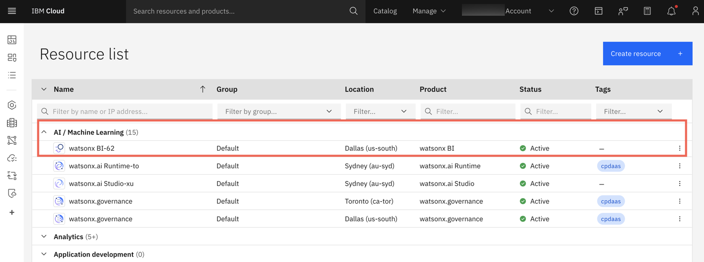

---
copyright:
  years: 2025, 2026
lastupdated: "2026-01-15"

keywords: quick start, provision, setup
subcollection: watsonx-bi

content-type: tutorial

---

{{site.data.keyword.attribute-definition-list}}

# Setting up {{site.data.keyword.wxbia_short}} as a Service for administrative users 
{: #getting-started_cloud}
{: toc-content-type="tutorial"}

These steps describe the typical tasks for an **IBM Cloud account owner** to provision and initialize the account for an organization:

## Step 1: Provisioning {{site.data.keyword.wxbia_short}} 
{: #step1_provision}
[Cloud account owner]{: tag-blue}

You can provision {{site.data.keyword.wxbia_short}} by creating an instance of the service in the IBM Cloud account.

1. Log into the [IBM Cloud account](https://cloud.ibm.com/login). 

2. Click **Create resource**.

  

3. Enter **{{site.data.keyword.wxbia_short}}** in the search field and select it from the catalog.

4. Select a pricing plan, accept the license agreement checkbox, and click **Create**. 

The new service instance appears under **AI/Machine learning** in the **Resource list**. 

## Step 2: Provisioning IBM watsonx.data intelligence
{: #step2_provision_data_intelligence}
[Cloud account owner]{: tag-blue}

Watsonx BI requires an active watsonx.data intelligence plan to be provisioned in the IBM Cloud account.

1. In the IBM Cloud account, click **Create resource**.

2. Enter **watsonx.data intelligence** in the search field and select it from the catalog.

3. Select a pricing plan, accept the license agreement checkbox, and click **Create**. 

4. The new service instance appears under **Analytics** in the **Resource list**. 

If watsonx.data intelligence is disabled or removed from the Cloud account, you might be able to restore it through [reclamation](/docs/account?topic=account-resource-reclamation&interface=cli){: external}. Otherwise,you must wait 7 days before provisioning watsonx.data intelligence again, or contact Support for assistance with troubleshooting. 
{: important}

## Step 3: Setting up and initializing {{site.data.keyword.wxbia_short}}
{: #step2_setup_initialize}
[Cloud account owner]{: tag-blue}

As an IBM Cloud account owner, you must set up and initialize {{site.data.keyword.wxbia_short}} before other users that you invite to your Cloud account can use {{site.data.keyword.wxbia_short}}. This step cannot be delegated to an Administrative user. 
{: requirement}

1. From the **Resource list**, select and launch the {{site.data.keyword.wxbia_short}} instance. 

2. Click **Start setup**.

3. Select a [Cloud Object Storage](https://dataplatform.cloud.ibm.com/docs/content/svc-welcome/cloud-object-storage.html?context=cpdaas&context=cpdaas&context=dph&context=analytics&context=cpdaas&context=analytics&context=analytics&context=analytics&context=cpdaas&context=analytics&context=cpdaas&context=analytics&context=analytics&context=analytics&context=cpdaas&context=analytics&context=analytics&context=cpdaas&context=cpdaas&context=analytics&context=analytics&context=dph&context=analytics&context=analytics&context=cpdaas&context=cpdaas&context=analytics&context=cpdaas&context=analytics&context=analytics&context=dph&context=cpdaas&context=analytics&context=analytics&context=analytics&context=analytics&context=cpdaas&context=analytics&context=analytics&context=analytics&context=analytics&context=cpdaas&context=cpdaas&context=analytics&context=analytics&context=cpdaas&context=cpdaas&context=analytics&context=analytics&context=cpdaas&context=cpdaas&context=analytics&context=analytics&context=analytics&context=dph&context=cpdaas&context=analytics&context=cpdaas&context=analytics&context=analytics&context=analytics&context=analytics&context=cpdaas&context=dph&context=cpdaas&context=cpdaas&context=analytics&context=analytics&context=analytics&context=cpdaas&context=analytics&context=analytics&context=analytics&context=analytics&context=analytics&context=analytics&context=dph&context=cpdaas&context=cpdaas&context=cpdaas&context=analytics&context=analytics&context=analytics&context=analytics&context=analytics&context=cpdaas&context=analytics&context=analytics&context=cpdaas&context=cpdaas&context=analytics&context=cpdaas&context=cpdaas&context=analytics&context=dph&context=analytics&context=analytics&context=cpdaas&context=analytics&context=cpdaas&context=cpdaas&context=cpdaas&context=analytics&context=cpdaas&locale=en&audience=wdp&audience=wdp&audience=wdp&audience=wdp&audience=wdp&audience=wdp&audience=wdp&audience=wdp&audience=wdp&audience=wdp&audience=wdp&audience=wdp&audience=wdp&audience=wdp&audience=wdp&audience=wdp&audience=wdp%253Fcontext%253Dcpdaas){: external} instance and click **Next**.  

4. (Optional) Choose a [sample](/docs/watsonx-bi?topic=watsonx-bi-using_samples){: external} to set up in your {{site.data.keyword.wxbia_short}} instance. 

5. Select the large language model to use in conversations.

6. [Invite users](/docs/watsonx-bi?topic=watsonx-bi-add_users_account){: external} to use your instance of {{site.data.keyword.wxbia_short}} (see Step 3 below). You can then: 

  a. [add users to the watsonx BI community](/docs/watsonx-bi?topic=watsonx-bi-roles){: external} and assign relevant roles (Administrator, Data analyst, or Analytics consumer)  
  
  b. [add users as collaborators to projects](/docs/watsonx-bi?topic=watsonx-bi-managing_projects){: external}.   

When you use {{site.data.keyword.wxbia_short}}, make sure that the selected account in the account switcher in the header is the one that has access to {{site.data.keyword.wxbia_short}}. 

## Step 4: Adding users to the watsonx BI account 
{: #step3_add_users_cloud_account}
[Cloud account owner]{: tag-blue} [Administrator]{: tag-blue}

As a **Cloud account owner** or **Administrator**, you add the people in your organization who need access to {{site.data.keyword.wxbia_full}} to the IBM Cloud account and then assign them the appropriate roles for their tasks. 

This is a two-step process:

1. Add administrative and non-administrative users to the IBM Cloud account

  This step gives users access to the account in general. During this step, you can set up access groups to simplify permissions and role assignment, and assign IAM roles to the users. 

  [IAM roles](/docs/watsonx-bi?topic=watsonx-bi-managing_iam){: external} provide Service and Platform level assignments, which determine access to service and platform resources and are always set in the IBM Cloud account. 

2. Add users to the BI community in watsonx BI 

  This step allows invited users to use watsonx BI based on their role. During this step, you will assign collaborator roles. [Collaborator roles](/docs/watsonx-bi?topic=watsonx-bi-roles){: external} determine what the user can do in {{site.data.keyword.wxbia_short}}. 

Before you begin, set up access groups to simplify user access policies, role assignment in watsonx BI, and access to projects. For more information, see [Managing IAM access for watsonx BI as a Service](/docs/watsonx-bi?topic=watsonx-bi-managing_iam){: external}. 
{: tip}

### Step 4a: Inviting users to the IBM Cloud account 
{: #invite_cloud_account}

1. Go to **Navigation Menu > Administration > Configurations and settings > Access (IAM)** and click **Invite users with Access (IAM)**. 

  You can also invite users directly from your IBM Cloud account by selecting **Manage > IAM > Users**. 

2. On the **IBM Cloud > Users > Invite users** page, enter one or more email addresses that are separated by commas, spaces, or line breaks. 

  You can add up to 100 email addresses in one go. The settings apply to all the email addresses.
  {: note}

3. Choose how you want to assign access. If you have created an access group with predefined access policies, select **Access groups**. Otherwise, select **Access policy**. 

  If you selected [Access groups](/docs/account?topic=account-access-management-overview#access-groups-iam){: external}, follow these steps to invite members of an access group to the watsonx BI account. 

    a. Select one or more access groups and click **Add** to add the users to the selection.

    b. Click **Invite** under **Access summary**. 

  If you selected [Access policy](/docs/account?topic=account-access-management-overview#access-policies-concept){: external}, follow these steps to invite users to the watsonx BI account.

    a. Under **Service**, enter **watsonx BI** in the search field and select it.

    b. Under **Resources**, select **All resources**. 

    c. Under **Roles and actions**, specify the IAM access that you want to assign. 
  
    The following are the required IAM roles for each collaborator role in watsonx BI:

    | watsonx BI user | IAM Service role  | IAM Plaform role|
    |-------|-------------|---------------|
    |Analytics consumer| Reader|       |
    |Data analyst| Writer | Viewer  |
    |Administrator| Administrator | Manager | 
    {: caption="IAM Access roles mapping by {{site.data.keyword.wxbia_short}} user type " caption-side="bottom"}
    
  d. Review the selections and click **Add**.

  e. Click **Invite** under **Access summary**. 

The new users receive an email invitation to join the account. 

If you invited users as part of an access group, you can immediately add the access group to the watsonx BI community and to a project. If you invited users individually, you need to wait for the users to accept the invitation before you can add them to the watsonx BI community or to projects.
{: important}

### Step 4b: Adding users to the watsonx BI community
{: #add_watsonxBI_community}

1. In watsonx BI, go to the **Navigation Menu** and select **Administration > Configurations and settings > Manage BI community**.

2. Click **Add members** and choose if you want to add individual users or groups. 

3. Select the individual users or access groups and assign the relevant collaborator role. 

For more information about collaborator roles, see [Roles and permissions in {{site.data.keyword.wxbia_short}}](/docs/watsonx-bi?topic=watsonx-bi-roles){: external}.

## Troubleshooting setup errors
{: #troubleshooting_setup}

 Here's a look at how to troubleshoot errors that you might encounter as you set up {{site.data.keyword.wxbia_short}}:

- **Error: You don't have access to {{site.data.keyword.wxbia_short}}. Contact your administrator to request access.**

  You or a user you invited to the Cloud account might see this error if: 

  | Scenario | Action  |
  |-------|-------------|
  | As a Cloud account owner, you do not have access to {{site.data.keyword.wxbia_short}} | Follow Steps 1 and 2 above to provision an instance and set up {{site.data.keyword.wxbia_short}}. |
  | The user is a part of a Cloud account that does not have access to {{site.data.keyword.wxbia_short}} | The Cloud account owner must provision an instance of {{site.data.keyword.wxbia_short}} in the account and set it up before users can use {{site.data.keyword.wxbia_short}} (Steps 1 and 2 above). |
  | The user is a part of a Cloud account with access to {{site.data.keyword.wxbia_short}} but they do not have access| Administrator must give the user access to {{site.data.keyword.wxbia_short}} |
  | {{site.data.keyword.wxbia_short}} is provisioned but not set up in the Cloud account | The Cloud account owner must set up {{site.data.keyword.wxbia_short}} before users in the account can use {{site.data.keyword.wxbia_short}} (see Step 2). | 
  | {{site.data.keyword.wxbia_short}} has not been provisioned at all | Follow Steps 1 and 2 above to provision an instance and set up {{site.data.keyword.wxbia_short}}.|
  {: caption="Access errors when setting up {{site.data.keyword.wxbia_short}}" caption-side="bottom"}

- **Error: Unable to connect to {{site.data.keyword.wxbia_short}} with the current account [account name]. If this is the one you want to work with, please contact your administrator. Otherwise select the right one from the account list in the header.**

  You or a user you invited to the Cloud account might see this error if: 

   | Scenario | Action  |
   |-------|-------------|
   | The user is a part of a Cloud account with access to {{site.data.keyword.wxbia_short}}, but their access was removed | The Cloud account owner can assign access to the user for {{site.data.keyword.wxbia_short}}.|
   | The user is a part of the Cloud account with access to {{site.data.keyword.wxbia_short}} but {{site.data.keyword.wxbia_short}} has not been set up on the account| The Cloud account owner must set up {{site.data.keyword.wxbia_short}} before the user can use it (see Step 2).|
   |The user is a part of multiple Cloud accounts and is trying to use {{site.data.keyword.wxbia_short}} with an account that doesn't have access | Select the right account in the account switcher that has access to {{site.data.keyword.wxbia_short}} and try again.
   {: caption="Access errors when setting up {{site.data.keyword.wxbia_short}}" caption-side="bottom"}
