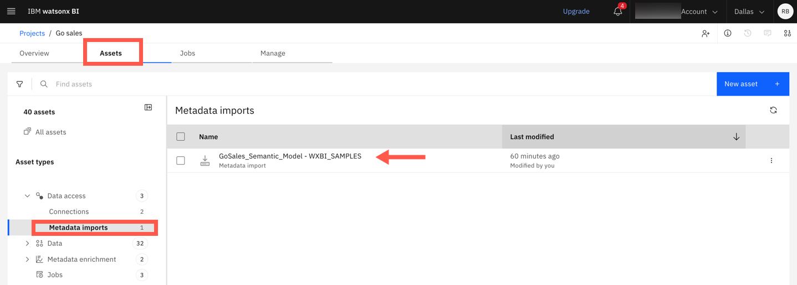
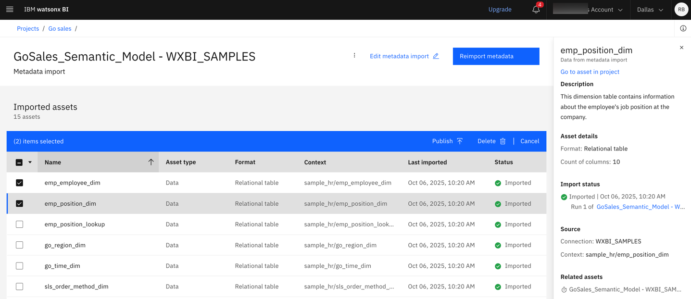
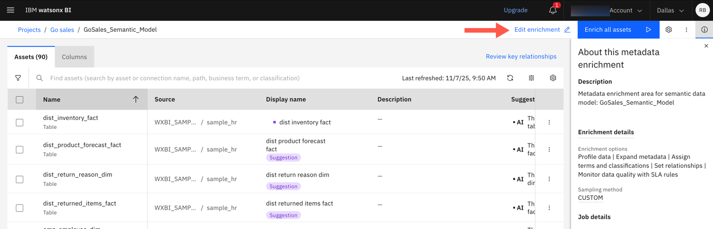

---
copyright:
  years: 2025
lastupdated: "2026-01-07"

keywords: modeling, new column, add column
subcollection: watsonx-bi

---

{{site.data.keyword.attribute-definition-list}}

# Adding a new column 
{: #model_new_column}

If new columns were added to the source database that you used to create metrics, you can add the new columns to the existing semantic data model without having to recreate the semantic model. {: #shortdesc}

## Step 1: Reimport metadata
{: #reimport_metadata_columns}

1. Go to **Navigation Menu > Projects > View all projects** and select the project which has the semantic data model that you want to add the columns to. 

2. Expand **Data access** under **Assets** and select **Metadata imports**.

3. Click the metadata import for the associated semantic data model. 

  

4. (Optional) Select the table where the new column was added. 

5. Click **Reimport metadata** to refresh the schema and bring in the new column from the source.

  

## Step 2: Re-run metadata enrichment
{: #rerun_mde_columns}

After metadata import completes, run metadata enrichment on the base data again.

1.  Go back to the project view and under **Metadata enrichment**, select the metadata enrichment asset associated with the semantic data model. 

2. Click **Enrich all assets** to re-run enrichment.

  

## Step 3: Add columns to the semantic data model
{: #add_columns_model}

1. Open the semantic data model from **Data and Metrics**.

2. Click the **Advanced mode** and expand the **Sources** panel in the semantic model.

3. Locate the new columns and drag them into the appropriate table in the semantic model.

4. Open the existing metric definition and click **Edit metric definition**. 

5. Include the new columns in the metric definition. Update the description, label, and any other metadata as needed.

6. Save the semantic data model and click the menu icon for the edited metric definition and export it. 
