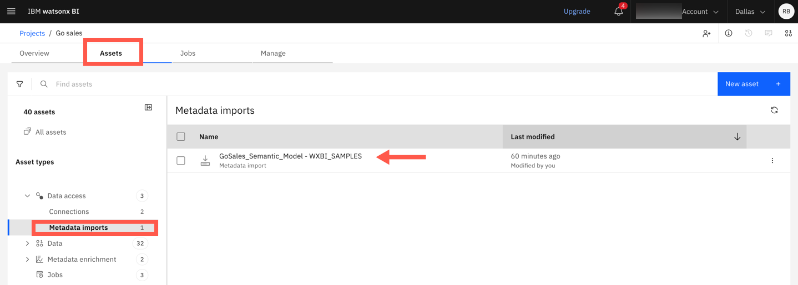
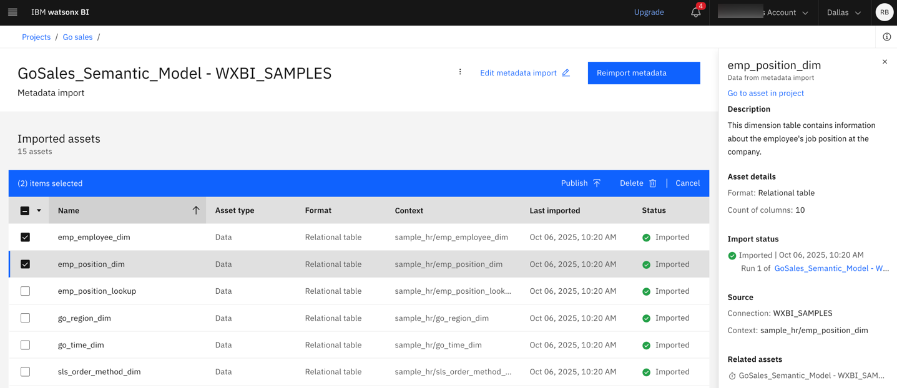

---
copyright:
  years: 2025, 2026
lastupdated: "2026-08-06"

keywords: modelling, new column, add column, adding new column to semantic data model
subcollection: watsonx-bi

---

{{site.data.keyword.attribute-definition-list}}

# Adding a new column 
{: #model_new_column}

If new columns were added to the source data that was used to create metrics, you can add these new columns to the existing semantic data model without having to recreate the semantic model. {: #shortdesc}

## Step 1: Refresh metadata
{: #reimport_metadata_columns}

Use the method that applies to your deployment.

### watsonx BI as a Service
{: #native_reimport}

1. Go to **Data and Metrics > Data sources**.

2. Locate the data source associated with the semantic data model.

3. Click the options menu (three dots) next to the data source name.

4. Select **Re-import metadata**.

If the data source uses watsonx BI enrichment, metadata enrichment starts automatically after the metadata import completes.

If the data source uses watsonx.data intelligence enrichment, continue to Step 2 to re-run metadata enrichment.

### IBM Software Hub
{: #swh_reimport}

1. Go to **Navigation menu > Projects > View all projects** and select the project that contains the semantic data model.

1. Expand **Data access** under **Assets** and select **Metadata imports**.

1. Select the metadata import associated with the semantic data model.

  

1. Optional: Select the table where the new column was added.

1. Click **Reimport metadata** to refresh the schema and import the new columns from the source.

  

If you use watsonx BI enrichment, metadata enrichment starts automatically after the metadata import completes. Skip to Step 3. 
{: important}

## Step 2: Re-run metadata enrichment
{: #rerun_mde_columns}

Complete this step only if your data source uses watsonx.data intelligence enrichment.

### watsonx BI as a Service
{: #saas_di_reenrich}

1. Go to **Data and Metrics > Data sources**.

1. Locate the data source associated with the semantic data model.

1. Click the options menu (three dots) next to the data source name.

1. Click **Re-enrich metadata**.

### IBM Software Hub
{: #swh_di_reenrich}

1. Go to the project that contains the semantic data model.

1. Under **Assets**, open **Curation > Metadata enrichments**.

1. Select the metadata enrichment asset associated with the semantic data model.

1. Click **Start full enrichment** to re-run metadata enrichment.

## Step 3: Add columns to the semantic data model
{: #add_columns_model}

1. Open the semantic data model from **Data and Metrics**.

2. Click the **Advanced mode** and expand the **Sources** panel in the semantic model.

3. Locate the new columns and drag them into the appropriate table in the semantic model.

4. Open the existing metric definition and click **Edit metric definition**. 

5. Include the new columns in the metric definition. Update the description, label, and any other metadata as needed.

6. Save the semantic data model and click the menu icon for the edited metric definition and export it. 
