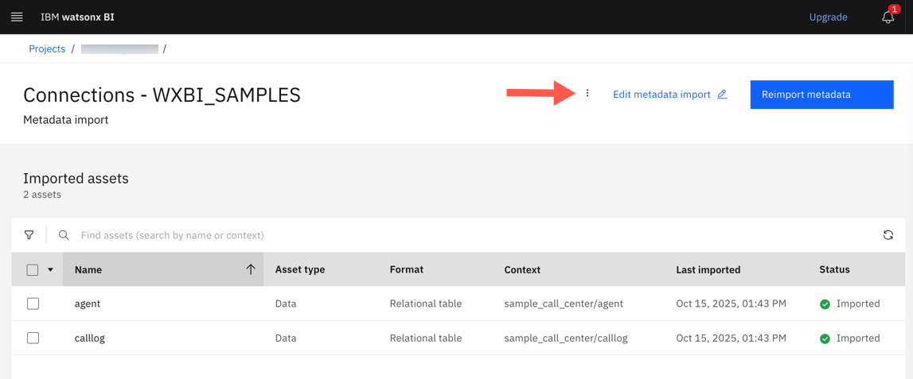
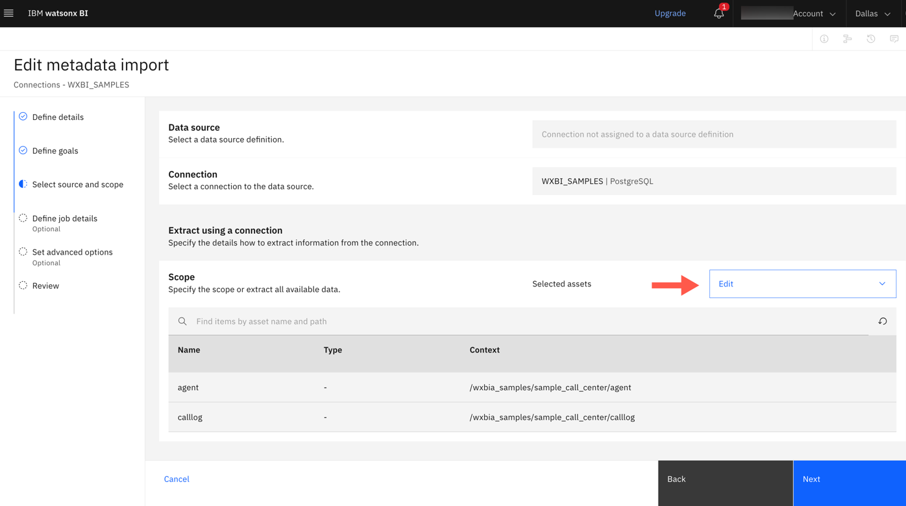
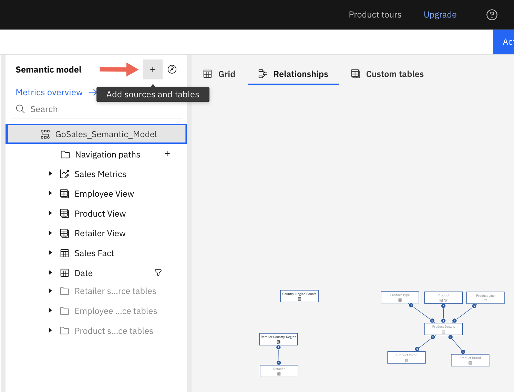

---
copyright:
  years: 2025
lastupdated: "2026-01-07"

keywords: modeling, new tables, add tables, modelling
subcollection: watsonx-bi

---

{{site.data.keyword.attribute-definition-list}}

# Adding a new table 
{: #model_new_table}

If new tables were added to the source database that you used to create metrics, you can add these tables to the existing semantic data model without having to recreate the semantic model. {: #shortdesc}

In the following steps, you will:

1. Update the metadata import job and reimport metadata to refresh asset information.

2. Update the metadata enrichment job and re-run enrichment to apply enrichment to the new tables.

3. Add the enriched tables to the semantic data model.

## Step 1: Edit the metadata import job to reimport metadata with new tables
{: #reimport_metadata_table}

1. Go to **Navigation Menu > Projects > View all projects** and select the project which has the semantic data model that you want to add the tables to. 

2. Go to the **Assets** tab and under **Data access**, click **Metadata import**. 

3. Open the metadata import asset associated with the semantic data model. 

4. Click **Edit metadata import**.

  

5. Edit the **Source and scope**.

6. Go to **Scope**, click **Edit** and click **Select assets**.

  

7. Select the new and existing data tables from the data connection and click **Select**.

8. Click **Next** to continue to the **Review** page and then click **Save**. 

9. Click **Reimport metadata** to refresh the schema and bring in the new tables from the source.

After metadata import completes successfully, you can see the new data assets on the **Projects > Assets** tab. 

## Step 2: Re-run metadata enrichment on the new tables
{: #rerun_mde_table}

After metadata import completes, run metadata enrichment on the base data again.

1.  Go back to the project view and under **Assets**, select the metadata enrichment asset associated with the semantic data model. 

2. Click **Edit enrichment**.

  

3. Edit the **Data scope**.

5. Click **Add assets to data scope**.

6. Select the metadata import asset that was created in the previous section and click **Select**. You can also select the new and existing tables from **Data asset**.

7. Click **Next** to continue to the **Review** page and then click **Save**. 

8. Click **Enrich all assets** to re-run enrichment.

## Step 3: Add tables to the semantic data model
{: #add_tables_model}

1. Open the semantic data model from **Data and Metrics**. 

2. Click the **Advanced mode** to open the semantic model.

3. Click the plus icon to add sources and tables to the semantic model.

  

4. Select the newly added tables and click **Add**.

  The semantic data model now displays the new tables along with the existing ones. 

5. Click **Actions > Save** to save the updated semantic data model. 
