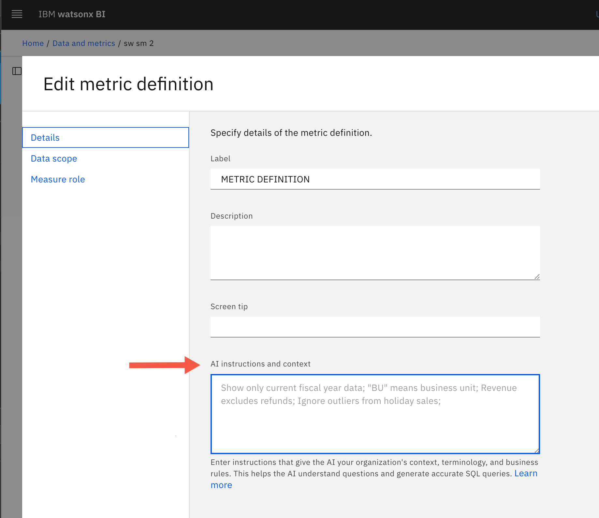

---
copyright:
  years: 2025, 2026
lastupdated: "2026-02-06"

keywords: ai instructions, business logic, tips for watasonx BI, optimizing data
subcollection: watsonx-bi


---

{{site.data.keyword.attribute-definition-list}}


# Adding instructions and context for AI
{: #instructions_ai}

You can use the **AI instructions and context** field in a semantic data model to provide instructions and context that the LLM follows when it interprets and answers questions about a specific metric. This field helps standardize complex business logic and reduce ambiguity.{: shortdesc}

This field supports plain text and a maximum of 10,000 characters. You can also add your instructions in Markdown though plain text is preferred for clarity. 

## How AI instructions are used
{: #use_ai_instructions}

The instructions that you provide, apply to only the metric where the instructions are defined. 

Use AI instructions in scenarios where consistent interpretation depends on rules, such as when:

- Your dataset uses business‑specific terminology that differs from column names

- You use standard calculation methods or rules, such as weighted averages or variance formulas

- Certain columns must always appear together for context

- You rely on default filters or display preferences

- You need to enforce organizational reporting standards, such as fiscal or seasonal time logic

When you ask a question about a metric that has instructions, {{site.data.keyword.wxbia_short}} notifies the LLM that the metric has custom rules and applies the rules during interpretation. 

Watsonx BI produces an SQL that aligns with expected patterns and validated behaviors.

## Best practices for AI instructions
{: #best_practices_ai}

The instructions that you provide in watsonx BI are for AI systems, not humans. Prioritize directness and conciseness over grammar.
{: important}

| Best practice | Details |
|-------|-------------|
|Enter context-specific instructions only|Enter instructions or helpful context directly into the field without an introduction. <br> <br> Avoid: "Follow these rules" or "These are instructions you must follow for every question." | 
|Define the exact behavior and avoid vague directions| To reference columns, remember to use the column identifier. <br><br> Use: “Always include retailer_city and retailer_type_en.” <br><br>Avoid: “Include relevant columns”|
|Use consistent terminology|For example, if you choose a term such as “current,” use it consistently throughout the instructions.|
|Avoid conflicting rules|Ensure the instructions do not contradict each other. Review them together for alignment.|
|Don’t assume prior knowledge and define all required formulas and logic explicitly| Use: “Calculate margin as (Total Gross Profit / Total Revenue) × 100.”<br><br> Avoid: “Use the standard margin calculation.” |
{: caption="Best practices for writing AI instructions"}
  
## Examples of AI instructions
{: #examples_instructions_ai}

### Calendar or season logic
{: #calendar_logic}

```
Treat “current year” as the latest CalendarYear available in the data.

Interpret seasons as:
Winter = December, January, February
Spring = March, April, May
Summer = June, July, August
Fall = September, October, November

Use these definitions when users reference seasons.
```
{: codeblock} 

### Fiscal year interpretation
{: #fiscal_year}

```
The fiscal year starts in April and ends in March of the following calendar year.
When users reference a fiscal year (for example, FY2023), interpret it as April 2022–March 2023.
```
{: codeblock}


### Monthly headcount metric
{: #monthly_headcount}

```
This table contains monthly headcount. Treat each month independently.

Without date filters:
Return SUM(headcount)
WHERE month_end_date = MAX(month_end_date)

For a specific month and year (for example, January 2025):
Return SUM(headcount)
WHERE EXTRACT(month FROM month_end_date) = 1
AND EXTRACT(year FROM month_end_date) = 2025
```
{: codeblock}

### Date and time-based filtering
{: #date_filtering}
````
For data/time based analysis, use date_hired if the question is related to new employees or promotions. Use termination date for attrition related questions.
````
{: codeblock}

### Filtering
{: #ai_filtering}

````
Include only **Active (A)** employees with **Agreement Code in {XX, ZZ}**; exclude **YY** unless explicitly requested.  
Contractors are not present in the dataset.
Apply **no org filters** when users reference *Organization* without an organizational qualifier.  
For **Job Profile Name** and **Primary Job Role**, exclude **null** values from results and groupings.  
For **Separation** analysis, use only employees with **Status = N** and **non-null** separation fields.  
Do not infer **Region** or **Geography** when explicit fields are present; match directly.
````
{: codeblock}

### Geography and region

```
Geography values: **EMEA, Americas, APAC, Japan**.  
Region values: **Canada, LA, US, GCG, Italy, DACH, MEA, UKI, ASEAN, Korea, NCEE, SPGI, France, AU/NZ, ISA, Japan**.
```
{: codeblock}

### Use instructions for semi-additive measures
{: #semi-additive}

If you have a semi-additive measure in your data, such as headcount or inventory, which cannot always be aggregated, you can add these to **AI instructions and context** field to use the appropriate calculation based on the time dimension. 

For example, you might have headcount data on a monthly basis but if you want the headcount for the year, you cannot add monthly headcount to get the yearly total. In this case, the value from the last month of the year would yield the correct yearly headcount. 

You can include a description instructing the AI on how to calculate headcount for the year.

```
Quarterly rollup: **use last month of quarter (Mar/Jun/Sep/Dec)**.
Yearly rollup: **use last month of year (Dec)**.
If user asks for **"Q3 headcount" with NO year specified**:
 -  *sum(Employee_Count) where extract(year from month_end_date) = extract(year from current_date) and extract(quarter from month_end_date) = 3*
- If user asks for **"2024 headcount"**:
  - *sum(Employee_Count) where extract(year from month_end_date) = 2024 and extract(month from month_end_date) = 12*
  ```
{: codeblock}

## Adding or modifying AI instructions
{: add_edit_ai_instructions}

To add or update the AI instructions for a metric in a semantic data model:

1. In **Data and Metrics**, open the semantic data model that contains the metric you want to update. 

1. Select **Advanced mode**, open the metric’s menu, and select **Edit metric definition**.

2. Go to the **Details** tab.

3. Enter or update your plain text instructions directly in the **AI instructions and context** field.

   

4. Save the semantic data model.

5. From the metric's menu, select **Export metric definition** to apply the instructions to the metric in the project.
