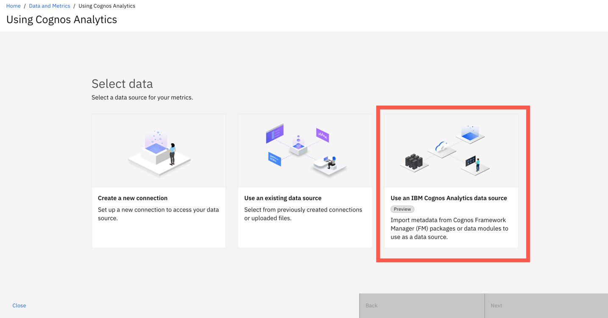
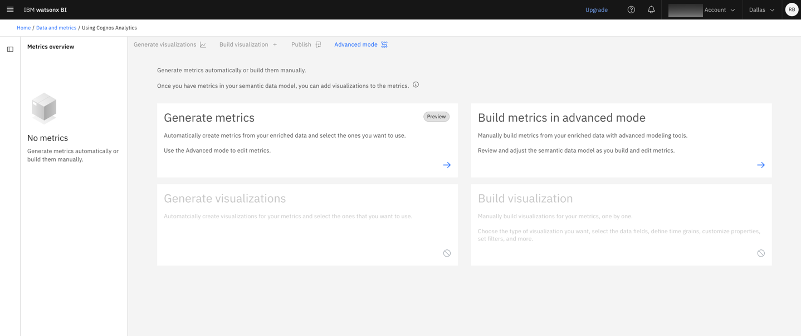
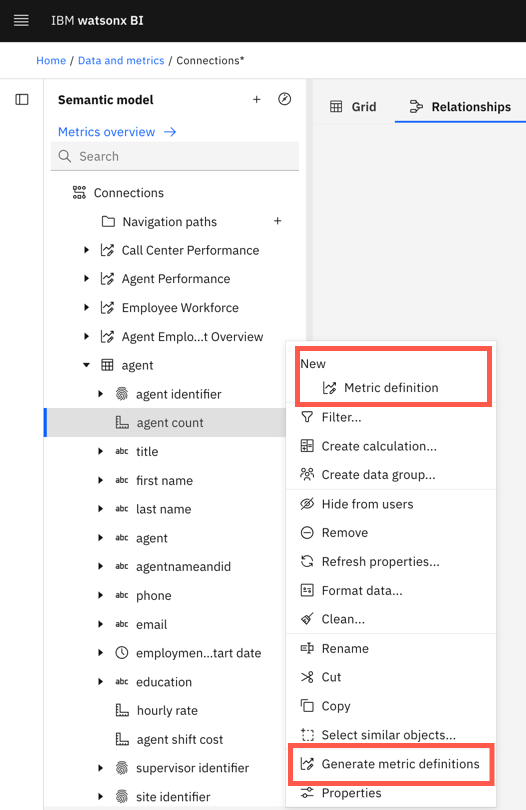

---
copyright:
  years: 2025, 2026
lastupdated: "2026-02-25"

keywords: cognos analytics, cognos, FM package
subcollection: watsonx-bi

---

{{site.data.keyword.attribute-definition-list}}

# IBM Cognos Analytics
{: #cognos}

[Preview]{: tag-teal} IBM Cognos Analytics is a business intelligence platform that supports the entire analytics cycle. By integrating Cognos Analytics with {{site.data.keyword.wxbia_full_notm}}, the rich metadata from Cognos Analytics becomes accessible to AI, making it easier for you to get insights from your data, without having to recreate existing data models. {: #shortdesc} 

This feature is a Technology Preview feature. Technology Preview offers customers early access to product features, allowing them to explore functionality and share feedback during development. These features are provided for evaluation purposes and might not be fully functional or complete.
{: important}

To use this integration, you need the IBM Cognos Analytics connector.

## Prerequisites
{: #prereq}

- A working {{site.data.keyword.wxbia_short}} environment

- A working Cognos Analytics environment

- A Framework Manager package (FM package) or a Data module (includes uploaded files and database)

- For Cognos Analytics on Premises, you need to create and set up a [Satellite Connector](/docs/watsonx-bi?topic=watsonx-bi-satellite){: external}.

## Limitations
{: #limitations_ca}

- Only relational FM packages and data modules are supported

- Dimensionally modelled (DMR) objects are not supported

- Dynamic cubes, uploaded files, and OLAP sources (such as SAP) are not supported 

- Data modules that use FM packages as a source are not supported 

## Supported versions
{: #ca_supported_version}

IBM Cognos Analytics 11.2.4 and later

## Connecting to Cognos Analytics and selecting a data source 
{: #connect_FM_data_module}

Before you begin, select an existing project or create a new one. You can quickly create a project from the **Data and Metrics** tab by clicking '+'  next to the project switcher.
{: Requirement}

When you select an FM package or Data module from a Cognos Analytics connection, {{site.data.keyword.wxbia_full_notm}} automatically populates the semantic data model with metadata from that source. 

1. On the **Data and Metrics** tab, click **Create metrics** and enter a name for your semantic data model.

2. On the **Select data** page, choose **Use an IBM Cognos Analytics data source**. 

   

3. Create and test a connection to your Cognos Analytics environment to check that {{site.data.keyword.wxbia_short}} can access it.

4. Select the FM package or Data module from your connection and click **Import**. You can select one or the other source type, but not both. 

5. Review your data and click **Next** to proceed. 

After you select your FM package or Data module, you will be taken directly to the **Metrics overview** page. 

When you use a Cognos Analytics data source, metadata enrichment is not required. 
{: note}

The **Metrics overview** page is your workspace for creating metrics, visualizing them, testing them in conversations, and refining the semantic data model with calculations, relationships, and more. Data analysts can also publish metrics to the **Metrics catalog** from this page.

## Semantic data model characteristics when using a Cognos data source
{: #using_cognos_data}

The semantic data model structure mirrors Cognos Analytic's data module architecture. Any business context that is defined in Cognos Analytics is automatically applied to your semantic data model in {{site.data.keyword.wxbia_short}}, along with all Cognos governance rules and permissions. 

Some restrictions to keep in mind:

- Tables from FM packages and Data modules cannot be previewed in the data grid

- Only metric definitions can be previewed in Advanced mode

- Calculations with the following property combination will not run in certain contexts:

   - Usage: Set to "Measure"

   - Aggregate: Set to "Calculated"

 These calculations cannot be previewed in the grid view or during profiling operations. However, they still compute correctly when used in visualizations and conversation experiences.

## Syncing the semantic data model
{: #sync_cognos_data}

If you are using an FM package, any changes made to the original FM package are automatically reflected in the semantic data model, ensuring it always stays up to date. The semantic data model maintains a direct reference to the FM package, which means that at load time, watsonx BI retrieves the package and always accesses the latest metadata.

If you are using a Data module, if the original data source changed since the connection was created, you are prompted to resync so that the semantic data model reflects the latest data. Resyncing is optional unless:

- New tables have been added or removed  

- Global calculations were added, removed, or modified  

- Global filters were added, removed, or modified  

Resyncing preserves all existing metric definitions in the semantic model.

If a metric definition references a table that was removed from the data module, the metric definition must be fixed or edited. Review metric definitions after a resync to ensure they continue to function correctly.

## Creating metrics from a Cognos data source
{: #metrics_ca_data}

For the best results in conversations, create metrics based on your Cognos data source. 

To create metrics automatically, click **Generate metrics** on the **Metrics overview** page. The time it takes to generate metrics depends on the size and complexity of your data. 

You can also generate metrics or build them manually in the semantic data model by using the **Advanced mode**. This option lets you choose the measures and tables that you want to use to create metrics, giving you more control on the metrics that you want to include in the semantic data model. 

To create metrics in the semantic data model:

1. Go to **Advanced mode** from the **Metrics overview** page.

1. In the **Semantic model** pane, select one or more measures or fact tables. 

1.  Click the menu icon next to the selection and choose **New > Metric definition** to build a metric definition manually. 

    -or- 
   
    Choose **Generate metric definitions** to create metrics automatically. 

    

1. Review the metric definitions. 

   Whether you generate metrics automatically or build them manually, check that each column has a meaningful name, description, and identifier. You can check these properties in the **Advanced mode > Metric definition > Properties**. For more information, see [Optimizing data for AI](/docs/watsonx-bi?topic=watsonx-bi-best_practices){: external}.
   {: tip}

1. Save the semantic data model. 

1. Select the metric definition that you just created and from its menu, select **Export metric definition**. 
   
   When you export a metric definition, it creates or updates a metric and makes it available for use in {{site.data.keyword.wxbia_short}}. Exporting also sends the metric definition through metadata enrichment, which is required to answer natural‑language questions about the data.

## Next steps
{: #next_steps_cognos}

After you finish creating metrics, you can navigate back to the **Metrics overview** page and do the following:
    
- [Edit metrics](/docs/watsonx-bi?topic=watsonx-bi-edit_metrics){: external}

- [Add visualizations to metrics](/docs/watsonx-bi?topic=watsonx-bi-add_viz_metrics){: external}  

- [Try a metric in a conversation](/docs/watsonx-bi?topic=watsonx-bi-try_metrics){: external}

- Use the [Advanced mode](/docs/watsonx-bi?topic=watsonx-bi-advanced_mode_model_data){: external} to make changes to the semantic data model (such as create new relationships, calculations, and more)

- [Publish metrics and visualizations](/docs/watsonx-bi?topic=watsonx-bi-publish_metrics){: external} to the **Metrics catalog** and specify access permissions (Data analysts only)
    
You can also go to the **Conversations** page to start asking questions about your data.

For more information, see [Overview of creating metrics](/docs/watsonx-bi?topic=watsonx-bi-overview_metrics).
