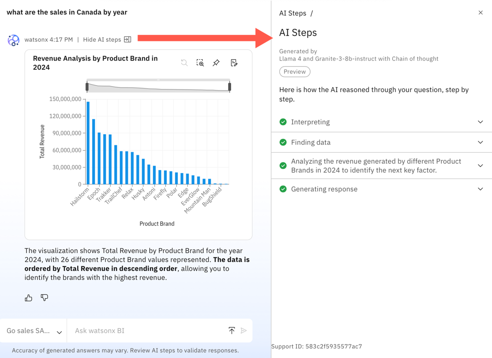

---
copyright:
  years: 2025
lastupdated: "2026-01-07"

keywords: choose llm, large language model
subcollection: watsonx-bi

---

{{site.data.keyword.attribute-definition-list}}

# Chain of Thought reasoning
{: #choose_llm}

[Preview]{: tag-teal} Chain of Thought reasoning is a different approach to generating answers that is available with the Meta Llama 4 and IBM Granite-3-8b-instruct option. With Chain of Thought reasoning, watsonx BI generates more thoughtful responses with step-by-step reasoning, which allows it to handle complex and more nuanced questions that are beyond simple queries. {: #shortdesc} 

This feature is a Technology Preview feature in {{site.data.keyword.wxbia_short}} as a Service. Technology Preview offers customers early access to product features, allowing them to explore functionality and share feedback during development. These features are provided for evaluation purposes and might not be fully functional or complete.
{: important}

Chain of Thought's structured answers, which reflect the AI’s reasoning path, are helpful when you want to see how watsonx BI built the query or queries that were necessary to answer your question. 

Another advantage of using Chain of Thought is that it can answer complex or multi-part questions that might require multiple queries or visualizations. An example of a multi-part query that benefits from Chain of Thought reasoning is *Show me how many units of the Extreme brand were sold in Canada by product, and identify which countries sold more units*.

This question spans multiple dimensions and regions and cannot be answered in a single chart. Instead, it requires two distinct visualizations: 

- Total quantity of Extreme brand sold by product in Canada

- A comparison of units sold by country

Chain of Thought reasoning ensures that the LLM interprets the relationships, organizes the data accurately, and presents the results in a coherent, structured way.

## How Chain of Thought works
{: #reasoning}

When a response is generating in watsonx BI, you can view the reasoning steps that are in progress. You can also click **Reasoning...** to view more details about how Chain of Thought is deriving the answer. 

After the response is generated, you can view the reasoning steps and explanation by clicking **Show AI steps**. 

{: caption="Detailed reasoning displays in the AI steps panel" caption-side="bottom"}

Reasoning steps and explanation can include: 

- An interpretation of the question and how the LLM decided to answer. 

- The data source that the AI chose to answer the question. The LLM picks the best asset it thinks can answer the question, but the option is available to select an alternate asset if other choices were found.

  You might see a repetition of this step if the LLM decides that the asset chosen cannot answer the question effectively and goes back to find other assets that can. 

- Intermediate calculations and filters that feed into the reasoning.

- The exact SQL that was generated and executed. 

- Live data for the query, which allows you to see the same logic replayed on the current data state. This means that the live data might differ from the original data used if the underlying data has changed.

A key differentiator with Chain of Thought is that the steps needed to answer a question might vary. You will see only those steps that were required to answer the question and you might see the same step more than once if watsonx BI determines that it needs to re-evaluate a previous choice. 

Additionally, Chain of Thought can also reuse information from a previous question.

With Chain of Thought, watsonx BI also determines the best way to present the results as a visualization, a text response, or both.

### Disambiguating filter names and values
{: #disambiguating_cot}

Sometimes a question can be ambiguous, meaning more than one column could match your request. For example, if you ask for sales and the table includes SALES_COUNT and REVENUE, or if you ask about activity in 2025 and the table includes SALE_DATE, SHIPMENT_DATE, and PAYMENT_DATE.

In these cases, you can check which column the AI selected in the reasoning steps. If the choice isn’t what you intended, ask the AI to reconsider. For example, if you ask, *How many units were sold in 2025?* and the AI uses SALE_DATE, you can correct it by saying:

- *What about by payment date?*

- *Use payment date instead of sale date*

- *I mean payment date, not sale date*

You can also include more context in your original question:

- *How many units were paid for in 2025?*

### Current response behaviour
{: #limitations_cot}

Chain of Thought introduces advanced reasoning capabilities, and its responses might differ from those of other LLMs in the following ways:

- Insights with visualizations - Chain of Thought does not generate insights alongside charts.

- Chart customization - You cannot request a particular type of chart or customize chart attributes through conversation.

- Response presentation - The way responses display can vary based on the AI’s reasoning. For example, the AI determines whether to include a chart, which chart type best answers your question, and how the accompanying text is structured.

- Visualization titles -  Titles are generated automatically as part of AI reasoning. 

- Data availability question - When you ask “What data do I have available to me?”, Chain of Thought provides a more detailed response. It provides a list of metrics and tables in the project, along with descriptions for each to help you understand your data context.
