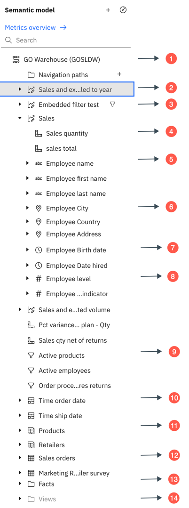

---
copyright:
  years: 2025
lastupdated: "2026-02-05"

keywords: semantic, data model, data modeling
subcollection: watsonx-bi

---

{{site.data.keyword.attribute-definition-list}}

# Data modelling in {{site.data.keyword.wxbia_short}}
{: #advanced_mode_model_data}

Use the **Advanced mode** to view and edit semantic data models. You can open a semantic data model from **Data and metrics** and navigate to the **Advanced mode** from the **Metrics overview** page.{: #shortdesc}

You can enhance your semantic data model by creating relationships between data tables, applying filters, creating calculations and navigation paths, changing column formatting, and more.

## Semantic data model panel
{: #semantic_panel}

The semantic data model panel contains the data tree that shows metric definitions, tables, columns, calculations, folders, and more. This is the main space for selecting and editing in the data model.

Here is an example of what a data tree might look like:

{: caption="A semantic data model panel depicting different items." caption-side="bottom"}

1. Semantic data model name - This is the root node. 
2. Metric 
3. A metric with an embedded filter 
4. Measure
5. Attribute that is a text data type
6. Attribute that represents a geographic taxonomy
7. Attribute that is a date, datetime, time, or timestamp data type
8. Attribute that is a numeric data type
9. Standalone filter
10. Alias
11. View
12. Table (also known as a query subject)
13. Folder
14. Hidden folder

Click the context menu icon for the semantic data model, table, or column to view its modeling and editing context menu options. Here you can start creating metrics, joining tables, creating filters and calculations, or renaming and deleting items.

The list of items in the data tree can be long. To find the data faster, use the search box in the data tree. 

## Grid tab
{: #grid_tab}

Use the grid view to examine the actual data in table columns and rows.

Select a table or column in the data tree or in the diagram, and click the Grid icon representing data view to open the data view.

Review and explore the columns that are available for you. The data fields that are in the columns are not sorted. To sort this data, click a column heading and select the sort type from the menu.

## Relationships tab
{: #relation_tab}

This tab shows the relationships diagram. The diagram is a graphical representation of table relationships in a semantic data model. You can use the diagram view to examine the relationships, edit the semantic data model, and view the cardinality information for the relationships.

Right-click a table in the diagram to view the table context menu that can be your starting point for creating joins or filters, renaming the table, viewing the table properties, or removing it from the semantic model.

Click any table join to see the join summary information that includes the matching keys. When you right-click the join line, the context menu appears with options for editing or deleting the join.

Right-click one or more tables in the diagram, and click **Auto-arrange**. The diagram is redrawn around the first selected table allowing you to focus on the selected tables and their relationships.

In the Diagram settings box, select the Cardinality check box to show the cardinality of relationships between different tables in your semantic data model. Move the Degrees of separation slider. Depending on the slider position, the diagram shows different degrees of relationships between tables. Select one or more tables in the diagram, and use the Focus mode to work with the selected tables.

## Custom tables tab
{: #custom_tables}

The Custom tables is the main space for creating, viewing, and managing custom tables in a semantic data model. This tab is displayed by default, even if the semantic data model doesn't contain any custom tables. To start creating a new table, click **Create custom table**. If the semantic data model already contains custom tables, the table names are listed when you click the tab.

## Sources panel
{: #sources_panel}

The **Sources** panel shows the sources of data that the semantic data model contains. A copy of this data is available in the semantic data model.

Except for FM packages, you can expand the specific source to view its tables and columns. Drag tables onto the data model panel or onto the diagram to add them to the data model.

You can expand the source to view its tables and columns. Drag tables onto the semantic data model panel.

From the source context menu, you can initiate actions such as relinking sources.

## Validation panel
{: #validation_panel}

To validate the semantic data model, click **Validate** from the semantic data model context menu.

If errors or warnings are discovered, the failed or warning validation icon is displayed for tables, columns, expressions, or joins. Click these icons to view the validation messages. 

## Expression editor
{: #expression_editor_tool}

The expression editor is an SQL editing tool that you can use to create or edit SQL-based tables, calculations, filters, or data groups.

You can create expressions by typing the code or dragging items from the data tree. The validation and data preview capabilities help to quickly verify and troubleshoot the expressions. The code editing capabilities include: inserting comments, auto-complete function, pretty-print, high-contrast mode, and different font sizes. The information panel shows details and provides examples of supported functions that are used in the expressions.

## Related links
{: #related_links_modeling}

- [Relationship joins](/docs/watsonx-bi?topic=watsonx-bi-relationships){: external}
- [Calculations](/docs/watsonx-bi?topic=watsonx-bi-calculations){: external}
- [Filters](/docs/watsonx-bi?topic=watsonx-bi-model_filters){: external}
- [Object properties](/docs/watsonx-bi?topic=watsonx-bi-model_object_prop){: external}
- [Optimizing your data for AI](/docs/watsonx-bi?topic=watsonx-bi-best_practices){: external}
