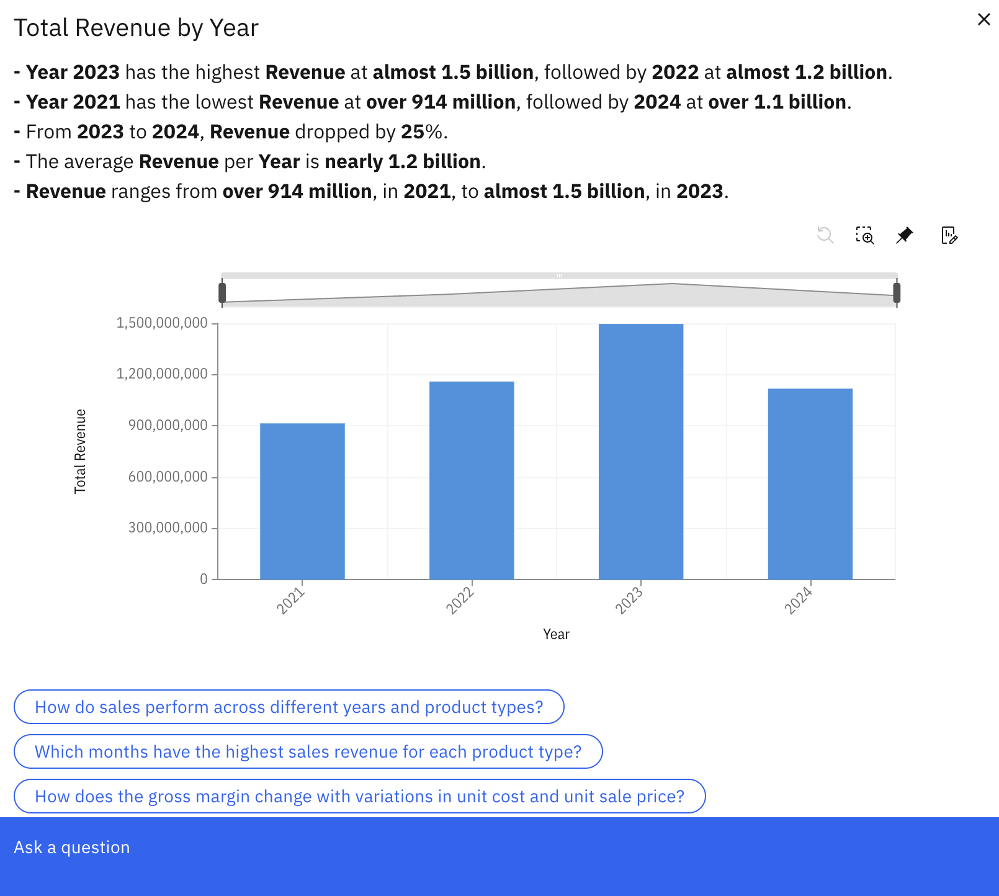
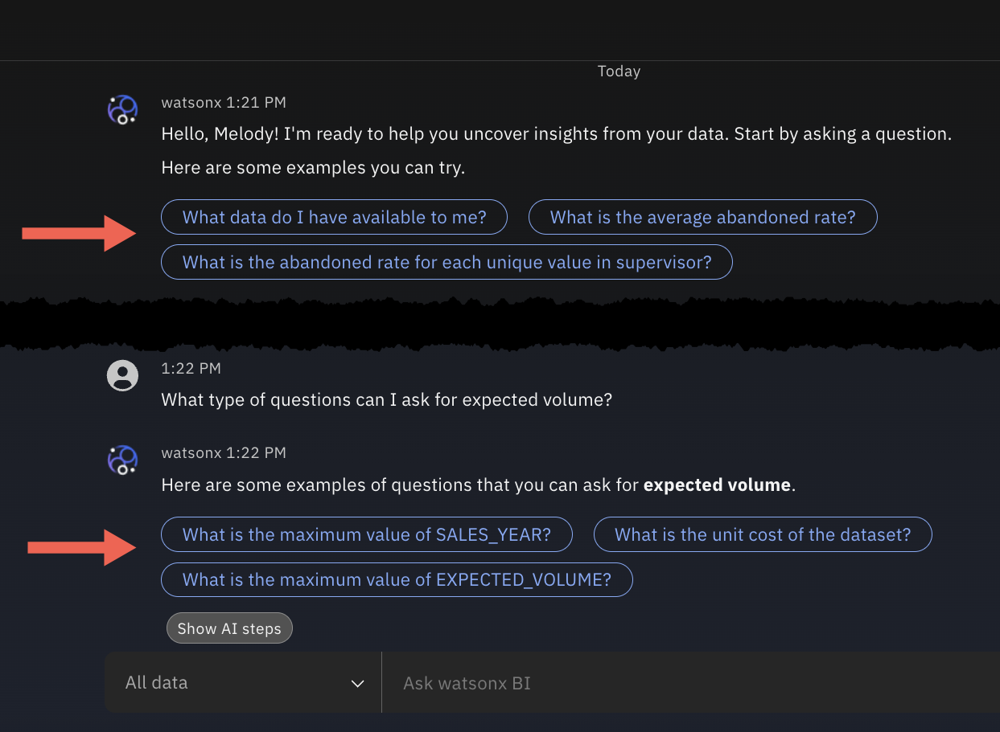

---
copyright:
  years: 2025
lastupdated: "2026-02-26"

keywords: conversations, getting started
subcollection: watsonx-bi

---

{{site.data.keyword.attribute-definition-list}}

# An overview of Conversations
{: #conv_overview}

The **Conversations** page is where you can ask questions to get deeper insights about your data and monitor key metrics. {: #shortdesc}

## Monitoring your Key metrics 
{: #monitor}

{{site.data.keyword.wxbia_full_notm}} keeps an eye on the data that matters to you. 

Metrics that are based on your business role and assigned to you by your organization are called **Mandatory metrics**. These metrics, along with any metrics that you pin from your conversations, display under **Key metrics** in the **Conversations** tab. 

A metric in the **Key metrics** panel is a visual representation of a metric and displays how the data is trending. You can see which metrics have changed and by how much at a glance. 

The **Key metrics** panel is scrollable and can be resized, making it easy to view more metrics if you have several metrics to monitor. You can also hide metrics from your view.

Click a metric to view more details about your data. If the data in your metric has changed, you can see related insights in natural language.

You can interact with a metric visualization to see data points and values. If{{site.data.keyword.wxbia_short}} recognizes that there are other chart types that might be relevant for your data, the **Options** icon in the visualization is enabled. You can click **Options** to select a different chart type.

Click **Ask a question** to ask questions about the metric or changes in the data. If you’re unsure about what to ask, click a suggested question. 

## Conversations
{: #conversations}

You can start a conversation with {{site.data.keyword.wxbia_short}} by:
 
- Entering a question directly in the input box  

- Clicking a metric in the **Key metrics** panel and asking a question

The chat canvas is an active conversation and any question you enter in the input box continues the conversation. To start a new conversation about a different data topic, click **New conversation**.

You can even set the scope of a conversation by selecting the data you want to ask about from the list in the input box. By default, the scope of a conversation is set to **All data**. 

All conversations are saved in the **Conversations** panel, titled by default with your first question. You can expand or collapse this panel at any time.

To manage saved conversations:

- Right‑click a conversation to rename or delete it.

- Use **Toggle selection mode** in the **Conversations** panel to select and delete multiple conversations at once.

- Use the search box to quickly find conversations by entering a keyword contained in their title.

To revisit a topic, open a saved conversation from the **Conversations** panel and continue asking questions directly within that thread.

## Suggested questions
{: #suggested}

Suggested questions are examples of questions that you can ask, which can generate insight into your data. To generate an answer to a suggested question, click the question bubble. {{site.data.keyword.wxbia_short_cap}} generates an answer and displays it in the currently active conversation.

You can access suggested questions in the expanded view of a metric in the **Key metrics** panel. These suggested questions can be used to get additional insight into the metric data of the selected visualization.

{: caption="Suggested questions display in a Key metric." caption-side="bottom"}

Suggested questions might also display at various points in a conversation. The questions displayed are based on the assets in the conversation's current scope, and can be asked to generate further insight.

When starting a new conversation, one additional question might be shown, "What data do I have available to me?". This question allows you to explore the data available to you. When you click the recommended question, {{site.data.keyword.wxbia_short}} responds back with a list of business terms or data assets for you to select from. At the end of the selection process, a list of suggested questions display that you can ask against the specific target asset.

{: caption="Suggested questions display under a response in a conversation" caption-side="bottom"}

## Getting insights for your data
{: #insights}

{{site.data.keyword.wxbia_short_cap}} is a conversational interface which means you can ask questions and get personalized insights and data summaries in natural language that are easy to understand. 

AI generated responses may not always be correct. Please verify generated responses and suggestions. 
{: important}

You can get insights from your data in the following ways:

- **From a metric** 

  Click a metric to review related insights. Insights are shown only if there is a change in the data. 
  
  To get more information about the metric or changes in your data, click **Ask a question** or try one of the suggested questions within the expanded metric. The suggested questions are curated based on your data and can guide you in data exploration. 

  When you ask a question from an expanded metric, {{site.data.keyword.wxbia_short}} transfers the visualization and your question into the chat canvas and generates a response. That one question starts an iterative question-and-answer style conversation that can help you uncover insights that might otherwise be hidden. 

- **Entering a question directly in the input box** 

  Enter your question about a metric or other business data in the input box. If you're unsure of what to ask, click a suggested question. 

  For more information about how to converse with {{site.data.keyword.wxbia_short}}, see [Asking questions in natural language](/docs/watsonx-bi?topic=watsonx-bi-ask){: external}.
  
