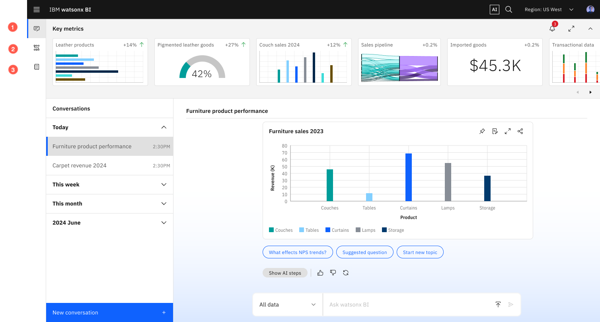

---
copyright:
  years: 2025
lastupdated: "2026-01-07"

keywords: interface, using watsonx BI
subcollection: watsonx-bi

---

{{site.data.keyword.attribute-definition-list}}

# About {{site.data.keyword.wxbia_short}}'s user interface
{: #user_interface}

The user interface of {{site.data.keyword.wxbia_short}} consists of the following main areas. {: #shortdesc}

(1) Conversations
:   This is where you can ask questions about your data to get insights and monitor metrics that matter to you. 

:   When you login to {{site.data.keyword.wxbia_short}}, you automatically start off on the **Conversations** page. 

(2) Data and Metrics
:   You can create new projects, create metrics, upload files, and access semantic data models that contain metrics from the **Data and Metrics** tab. Think of **Data and Metrics** as the starting point to prepare your data for conversations. 

(3) Metrics catalog
:   The **Metrics catalog** contains a collection of metrics that have been created for you by a Data analyst. You can view metrics and their related visualizations here and pin the ones that interest you to your **Key metrics** area in Conversations. 

{: caption="{{site.data.keyword.wxbia_short_cap}}'s **Conversations** page with the open navigation panel showing **Data and Metrics** and **Metrics catalog**." caption-side="bottom"}

(4) Configuration and settings 
:   You can manage access to your {{site.data.keyword.wxbia_short}} instance, manage storage, and set up samples from here. Depending on your role and permissions, you might be able to make other configuration changes. 

  Samples are currently not available in {{site.data.keyword.wxbia_short}} on IBM Software Hub.
  {: note}

(5) Navigation Menu
:   Use this menu to access the platform features such as your projects, governance artifacts, administrative settings, and more. To come back to the **Conversations** page, click **Home** in the **Navigation Menu**.

(6) Global navigation bar 
:   The global navigation bar gives you quick access to the product tours, product documentation, notifications, account switcher, and your profile.  

  Product tours are currently not avaialble in {{site.data.keyword.wxbia_short}} on IBM Software Hub.
  {: note}
  
Let's take a closer look at the following main components.

## Conversations
{: #converse}

When you log in to {{site.data.keyword.wxbia_short}}, you are on the **Conversations** page. This is where you can ask questions about your data and metrics and track how your key metrics are performing.

The **Conversations** page has the following areas:

Key metrics  
:   Your metrics, which are created for you by your organization and any metrics that you pin, appear here. Each visualization is a visual representation of a metric defined from your business data. 

Chat canvas
:   The chat canvas is where you enter your question in natural language and see the generated response. Think of the canvas as an active question-and-answer session. Select the scope of the conversation in the input box, type your question, and press Enter.

Conversations panel
:   You can view your conversation history by date here, manage your conversations, and restart an existing conversation.

## Data and Metrics 
{: #data_metrics}

The **Data and Metrics** tab is the launching point for any task related to your data. Here, you can:

- Select or create a new project

- Create metrics

- View metrics and visualizations that you created 

- Access semantic data models 

- Upload files 

Upload file is available in watsonx BI as a Service only.
{: note}

Creating metrics starts the data connection, preparation, and ingestion flow where the data undergoes metadata enrichment to prepare it for use in conversations. 

The scope of the metrics is defined in the semantic data model where you can use advanced modeling tools to add more context to your data, create calculations, and define relationships.

You can also upload files on **Data and Metrics** to quickly jump into asking questions about the data in the files.

## Metrics catalog
{: #metric_catalog}

Data analysts can create and publish metrics and related visualizations to the **Metrics catalog**. They can then assign these to other users in the organization. 

Assigned metrics display in the **Key metrics** panel on the **Conversations** page.

As an Analytics consumer, you can browse the **Metrics catalog** and pin metrics that are of interest to you. Pinned metrics appear in the **Key metrics** panel on the **Conversations** page. 

You can see some of the recently added metrics on the main page of the **Metrics catalog**. Click **View all** to view all the metrics you have access to. 

Metrics without visualizations appear as a tile whereas metrics with visualizations display with a thumbnail of the visualization.

Click a metric to view its details such as the data scope, actuals and targets, time grains, and time references. 

To ask a question for a specific metric, click the **Visualization** tab and click **Ask a question**. 

## Next steps
{: #next_interface}

- [An overview of creating metrics](/docs/watsonx-bi?topic=watsonx-bi-overview_metrics)

- [An overview of conversations](/docs/watsonx-bi?topic=watsonx-bi-conv_overview)
