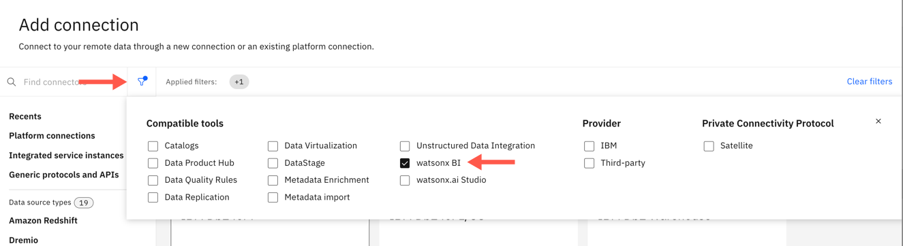

---

copyright:
  years: 2025
lastupdated: "2026-01-07"

keywords: known issues, limitations, watsonx BI

subcollection: watsonx-bi

---

{{site.data.keyword.attribute-definition-list}}

# Known issues in {{site.data.keyword.wxbia_short}} as a Service 
{: #known_issues_cloud}

The following issues and limitations apply to {{site.data.keyword.wxbia_full}} as a Service.  {: shortdesc}

- **IBM Db2 on-premise connection does not display in the watsonx BI supported connector list**

  The IBM Db2 on-premise connector does not display in the watsonx BI supported connectors list when you try to add a new connection in the metric creation flow. 

  Workaround:

  On the **Add connection** page, which lists the supported connectors, click the **Filter** icon and deselect **watsonx BI**.

  Clearing the filter shows connector types that are not supported in watsonx BI. Before adding new connections, ensure you filter the connector list to display only types supported by watsonx BI.
  {: important}

  

- **Users encounter an error after launching the watsonx BI service from the IBM Cloud catalog**
  
  You might encounter one of the following issues after launching the watsonx BI instance from the IBM Cloud catalog. 

  - Error - Your IBM watsonx BI apps weren't created.

  - You are navigated to the dataplatform home page (https://dataplatform.cloud.ibm.com/home2?context=cpdaas) where there are no links to watsonx BI.

  Workaround:

  - If you encounter the error, Your IBM watsonx BI apps weren't created, you can manually modify the URL to have **context=wdp** or **context=cpdaas**.

  - If you are navigated to the platform home page, re-launch the service or navigate directly to https://dataplatform.cloud.ibm.com/wxbi/conversations.

- **Continous loading state displays in Advanced mode after selecting a metric definition**

  You might encounter this issue if you  open a semantic data model from an imported project, and select a metric definitino in the **Advanced mode**. 

  Workaround:

  You can refresh the page and click the **Grid** tab in the semantic data model before selecting a metric definition.

- **Transferring an IBM Cloud account that you own requires you to manually add the new owner as an Administrator**

  When you transfer ownership of an IBM Cloud account after a watsonx BI instance has been set up, the new owner does not become an Administrator of the **Metrics catalog** by default. 
  
  Workaround: 

  As the owner of a Cloud account that you are transferring, you need to add the new account owner as an Administrator to the following:

  -  watsonx BI community on **Configurations and settings > Manage BI community**

  - Metrics catalog on the platform. To do this, go to the **Metrics catalog** in watsonx BI and go to the address bar to modify the URL. Replace the "wxbi/metrics-catalogs" in the URL to "data/catalogs" and press Enter. The URL will look like: "dataplatform.cloud.ibm.com/data/catalogs/..."
  
    In the **Metrics Catalog**, go to **Access control**. Set the role of the new account owner to **Admin**.

- **The Sources panel for FM package-based semantic data models does not display details**
  
  In semantic data models that are created from Cognos Analytics FM packages, The **Sources** panel does not display the package details. 
    
  This does not affect your ability to work with the data in these semantic data models. However, it might cause issues if, for example, you remove a table from the semantic data model and want to add it back in later but cannot access it through the **Sources** panel. 
    
  Workaround: 

  In the example scenario, if you have not yet saved the semantic data model, you can click **Undo** to revert the change. If you have already saved the semantic data model, you can re-import the FM package to restore the removed table.
  

## Limitations
{: #limitations_cloud}

- Import and export project does not support local files (.csv, .xls, .xlsx, or .tsv)

- Metrics created from a local file (.csv, .xls, .xlsx, or .tsv) cannot be published to the **Metrics catalog**. 

- Metrics and visualizations that are created from an imported Cognos Analytics Framework Manager package cannot be published to the **Metrics catalog**.
