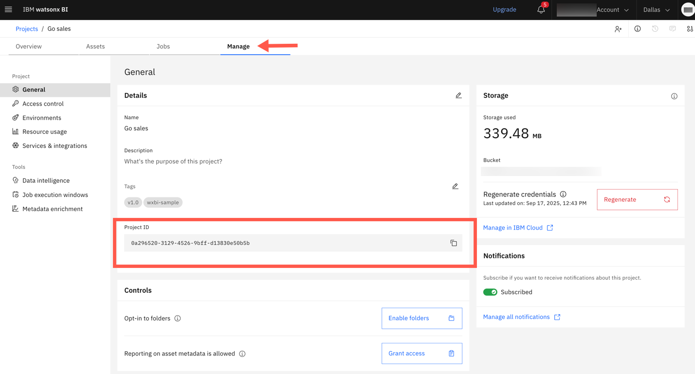

---
copyright:
  years: 2025
lastupdated: "2026-03-25"

keywords: mcp, model context protocol, watsonx Orchestrate
subcollection: watsonx-bi


---

{{site.data.keyword.attribute-definition-list}}

# IBM watsonx BI remote Model Context Protocol (MCP) server
{: #remote_mcp}

IBM watsonx BI remote MCP server is a Model Context Protocol (MCP) compliant service that seamlessly connects AI agents with data in watsonx BI, enabling intelligent data and insight retrieval. 
{: #shortdesc}

A remote MCP server is hosted on IBM infrastructure and accessed over a network, making it easier to collaborate and reduces the need for manual setup and configuration.

Key features:

Access to the watsonx BI semantic layer

:   Access data grounded in the watsonx BI semantic layer and governed metric definitions.

Natural language interface

:   Query data in watsonx BI using natural language and receive responses with tabular data.


## Capabilities 
{: #capabilities_mcp}

The remote MCP server exposes one static tool:

- Tool name: QUERY_DATA

- Description: Search for data and insights from your enterprise data warehouse

- Requires: Question in natural language used as an input to the QUERY_DATA tool

- Provides: Description, data, and SQL


## Prerequisites
{: #prereq_mcp}

Before you use the remote MCP server, make sure that you have the following:

- Valid access credentials (API key) 

  You must create a new API key. Do not use the API key that is automatically generated by watsonx BI.For information on how to create an API key, see [Managing user API keys](/docs/account?topic=account-userapikey&interface=ui){: external}. 
  {: important}

- AI agent framework that supports the MCP protocol

- A working environment of watsonx BI with:

   - At least one project 

   - Enriched data assets  

   - AI model - Any large language model (LLM) with [Chain of Thought reasoning](/docs/watsonx-bi?topic=watsonx-bi-choose_llm){: external} 

   

## Connecting to the remote MCP Server
{: #connect_mcp}

Use the following **endpoint** to connect your AI agent to the watsonx BI remote MCP server:

[https://api.dataplatform.cloud.ibm.com/wxbi/v1/mcp](https://api.dataplatform.cloud.ibm.com/wxbi/v1/mcp) {: external}


### Example install command
{: #example_install_cmd}

You can use the following **install command** to quickly connect to the remote MCP server:

```
npx -y mcp-remote https://api.dataplatform.cloud.ibm.com/wxbi/v1/mcp --header x-api-key:<user-iam-account-api-key>

``` 
{: codeblock}

Or use this command:

```
"wxbi-mcp-server": {
   "command": "npx",
   "args": [
    "-y",
    "mcp-remote",
    "https://api.dataplatform.cloud.ibm.com/wxbi/v1/mcp",
    "--header",
    "x-api-key:<user-iam-account-api-key>",     
    "--header",
    "asset-id-list:<asset_id_1>@<project_id_1>@project_id,<asset_id_2>@<project_id_2>@project_id"
   ]
}
```
{: codeblock}

#### Headers (Optional)
{: #headers}

You can scope the wxBI MCP Server to specific assets by adding additional headers:

- `project-id-list` to scope to a list of data-platform project ids. (ex: project-id-list:<project_id1>,<project_id2>)

- `catalog-id-list` to scope to a catalog id (ex: catalog-id-list:<catalog_id1>)

- `asset-id-list` to scope to a list of ThreePartIds of data assets (ex:`asset-Id-list`:<asset_id1>@<project_id1>@project_id,<asset_id2>@<project_id1>@project_id,<asset_id2>@<catalog_id1>@catalog_id)

#### Header priority 
{: #header_priority}

:   Priority 1: `asset-id-list` (cannot coexist with `project-id-list` or `catalog-id-list`)

:   Priority 2: `project-id-list` and `catalog-id-list` (can be used together)

#### How to get the project and asset id
{: #project_asset_id}

To get the project id: 

1. Select **View all projects** from **Navigation Menu > Projects**.

2. Select the project and go to the **Manage** tab. 

3. Copy the **Project ID** from the **Details** section. 

   


To get the asset id for a data asset:

1. Select **View all projects** from **Navigation Menu > Projects**.

1. Select the project that contains the data asset and go to the **Assets** tab. 

1. Select the data asset to open **Preview asset**.

1. Copy the portion of the URL that displays after `/data-assets/`.  

   For example, in the following URL:

   https://dataplatform.cloud.ibm.com/projects/0a296520-3129-4526-9bff-d13830e50b5b/data-assets/4570c0bb-a414-4e97-b2fd-25b533e4ceed/preview 

   the asset ID is: 
   
   `4570c0bb-a414-4e97-b2fd-25b533e4ceed`


## Integrating with IBM watsonx Orchestrate
{: #integration_orchestrate}

The watsonx BI remote MCP server integrates with IBM watsonx Orchestrate. For more information, see the following: 

-	[MCP servers in IBM watsonx Orchestrate](https://www.ibm.com/docs/en/watsonx/watson-orchestrate/base?topic=tools-mcp-servers){: external}

-	[Importing tools from an MCP server in watsonx Orchestrate](https://www.ibm.com/docs/en/watsonx/watson-orchestrate/base?topic=servers-importing-tools-from-mcp-server#import-tools-MCP-server){: external}

## Limitations of remote MCP Server
{: #limitations_mcp}

-	Supports business intelligence queries only; asset overview questions are not supported

-	Responses are textual and include tabular data only

-	Visualizations are not supported
