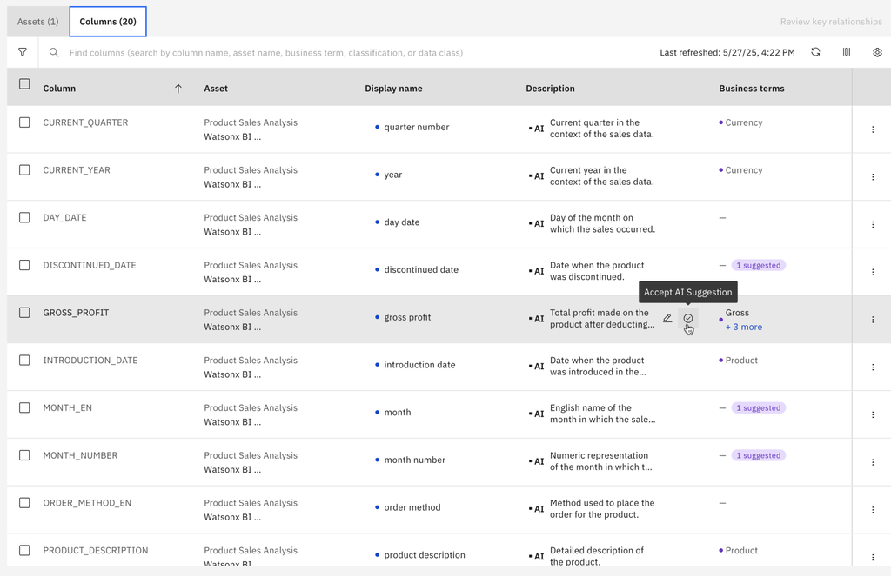
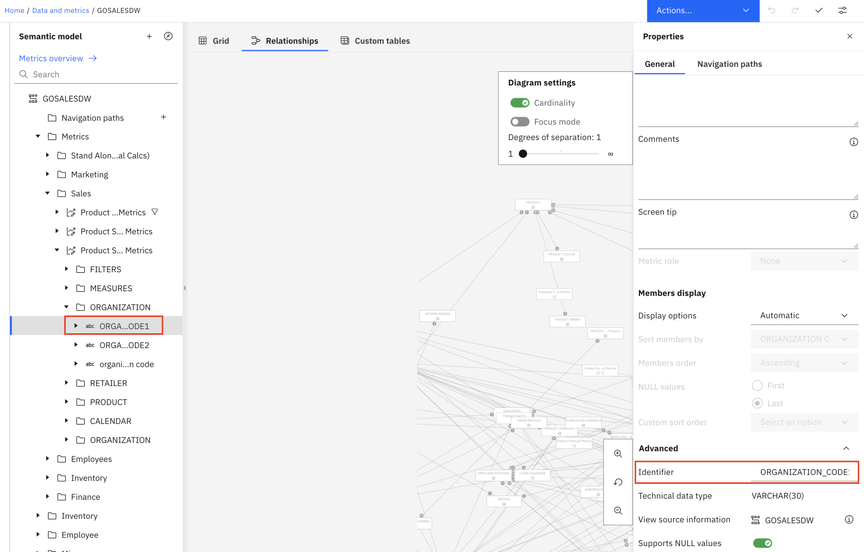
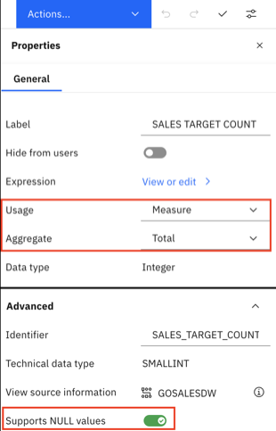
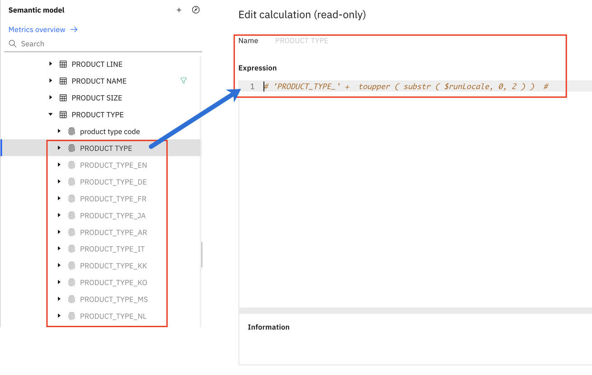
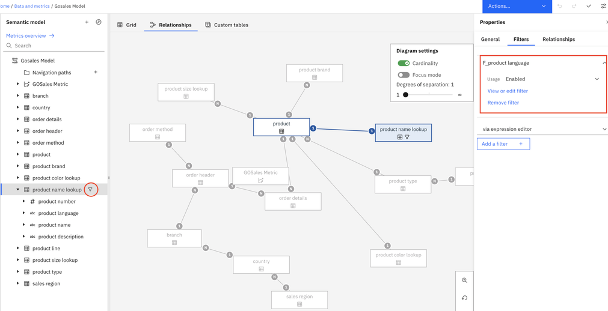
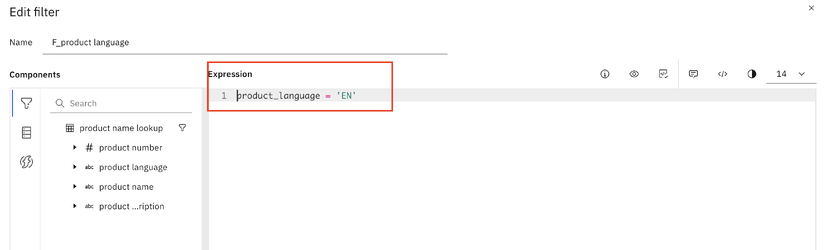

---
copyright:
  years: 2024
lastupdated: "2025-07-23"

keywords: best practices, tips for watasonx BI, optimizing data
subcollection: watsonx-bi

---

{{site.data.keyword.attribute-definition-list}}

# Optimizing data for AI
{: #best_practices}

IBM watsonx BI is a powerful analytics tool that uses large language models (LLM) to run complex, multi-step BI queries on your data. While watsonx BI has contextual understanding of data and can quickly respond to your questions, the quality of data determines the quality of the LLM’s generated responses. {: #shortdesc}

To enhance the quality of the generated query and the final answer, it is important to provide clear and comprehensive context to the LLM. 

The following factors are used by the LLM to understand questions and the context of your data
when generating query statements:

- Asset name
- Asset description
- Column name (Id)
- Column display name
- Column description
- Column data type, usage, aggregate and nullable
- Sampled columns

Here some things that you can do to prepare your data for use by AI. 

## Add business terms 
{: #tip_add_terms}

Watsonx BI comes with predefined business terms. These business terms act as metadata to enrich data assets so that AI can better understand your data and provide accurate responses to your questions.

If your organization's business terminology is different, consider adding business terms to describe the contents of your data. For more information, see [Business terms](/docs/watsonx-bi?topic=watsonx-bi-business_terms){: external}.

## Use unique names for data assets
{: #tip_unique_names}

To avoid ambiguity and confusion, use unique and descriptive names for data assets, including metrics. 

## Each Asset and Column needs a display name and description
{: #tip_display_name}

Review the metadata enrichment results in the metric creation process to ensure each Asset and Column has a meaningful and accurate AI-generated Display name and Description. 

You can also access the metadata enrichment from the Project asset tab by selecting the relevant metadata enrichment asset.

You can accept the AI-suggested name and description or click **Edit** to add your own.

{: caption="Metadata enrichment review page displays the AI generated terms and assignments." caption-side="bottom"}

When you edit the Display name or Description in the metadata enrichment asset, the updates might get overwritten if enrichment is run again or if a metric definition is deleted or edited and exported. To avoid this, it is recommended to make your changes in the semantic data model instead (see #2 in the section below).
{: important}

When the confidence score of an AI-suggested name or description does not exceed the minimum threshold, the corresponding cell is blank. In that case, click the pencil icon next to the suggestion and provide a meaningful name or description for that asset or column.

Descriptions must be concise and reflect the purpose of the column. During query generation in a conversation, the AI uses both the identifier, name, and description (potentially with sampled data) to select the best columns to answer the question. Avoid repetitive descriptions, where every description includes the same text, especially when the repeated content is how users will frequently ask questions.
{: tip}

## Model data in the semantic data model to help query generation
{: #tip_model}

### 1. Add clear Column Identifiers
{: #tip_identifiers}

To help the LLM understand the table schema correctly and easily, you need to ensure that the Column Identifiers are unique and clearly worded. These identifiers should be worded in a way that aligns with how users are likely to ask questions. 

For example, if an asset is about product sales or revenue, column identifier “SALES_YEAR”/”SALES_DATE” would work better than “CURRENT_YEAR”/”CURRENT_DATE”, as it describes what the temporal columns represent.Similarly, if the asset is about sales target, use column identifiers such as “SALES_TARGET_YEAR“/”SALES_TARGET_DATE”.

On the other hand, when multiple fact metrics come into play (for example, revenue + planned revenue in a single metric definition with a shared time dimension), having more general temporal column identifiers might be beneficial.

To change the column identifiers in a metric definition:

1. On the **Data and Metrics** tab, open the semantic data model that has the metric definition you want to edit.

2. Click the **Advanced mode**.

3. Under the metric definition, select the column you want to add the identifier to.

4. Open its **Properties** tab and scroll down to the Advanced section.

5. Enter the **Identifier** value.

6. Under **Actions**, click **Save** to save the semantic data model.

7. Select the metric definition that you just made changes to and click **Export metric definition**.

Exporting the metric definition runs metadata enrichment again and updates the existing metric, making it available for use in conversations.

{: caption="A Properties panel displays the Column identifier field." caption-side="bottom"}

You can also review and update the column identifiers in the metadata enrichment asset after enrichment completes. You can access the metadata enrichment asset on the **Projects asset** tab (**Home > Projects > View all projects**).

### 2. Ordering of user-defined name and description
{: #tip_desc}

You can add a display name and description for a metric column in the semantic data model. The order of priority for the display name and description is the following:

1. User-defined in the semantic data model

2. User-defined in the metadata enrichment asset

3. AI-suggested or generated in the metadata enrichment asset

To add a Display name and Description for a metric column in the semantic data model:

1. On the **Data and Metrics** tab, open the semantic data model that has the metric definition you want to edit.

2. Click the **Advanced mode**.

3. Under the metric definition, select the column you want to add a display name and description to.

4. Open its **Properties** tab and enter the name in the **Label** field and description in the **Description** field.

5. Under **Actions**, click **Save** to save the semantic data model.

6. Select the metric definition that you just made changes to and click **Export metric definition**.

Ensure that the name and description are worded based on your business context and how users will likely ask questions. For example, if there is a column called "manager" but your business users use the word "boss" then reflect that in the description. In another example, if you want AI to use "Cost of Goods Sold" column to answer questions about "Cost breakdown", then add that phrase to the description of the column.
{: tip}

### 3. Double check the “Usage”, “Aggregate” and “Nullable” fields for each column
{: #tip_fields}

In the semantic data model, check the column properties to ensure that the Usage, Aggregate, and Supports NULL values fields are correct.

For example, for a numerical column called Revenue, the Usage should be Measure, rather than Attribute. If the sum of the revenue is commonly used in a question, the default Aggregate should be Total, rather than Average.

Sometimes data like “unit_cost” or “unit_sale_price” is treated like a “Measure”. However, these are actually attributes of a product.

{: caption="An open Properties panel displays the usage, aggregate, and null value fields." caption-side="bottom"}

### 4. Remove unnecessary columns from the data
{: #tip_remove}

Remove columns from metric definitions that might not be useful in answering questions by deleting them or hiding them from the base table or metric definition.

For example, if a metric definition contains both “COMPANY_KEY” and “COMPANY_ID” columns, the AI might have difficulty deciding which one to choose when generating the query. If a business user is likely to only ask for “COMPANY_ID”, remove “COMPANY_KEY” column from the metric definition or hide it. Any columns that you hide, appear in grey and are moved to the bottom of the semantic model panel.

If you have multiple language-specific versions of the same column, such as the “PRODUCT_TYPE_” columns in the example below, you can create a new unified “PRODUCT_TYPE” column with an expression that can automatically pick the appropriate language-specific version, and hide the other redundant “PRODUCT_TYPE_” columns.

{: caption="A calculations displays in the Expression editor." caption-side="bottom"}

### 5. Data quality matters
{: #tip_quality}

Ensure that column values are correct and relevant.

Sampled column values are used by the LLM to construct well-formed filters. When you ask a question, watsonx BI’s NER step extracts filter values from the question, converts them into embeddings, and compares the filter embeddings with the columns’ sampled embeddings that are stored in Cloud Object Storage. The matched sampled columns feed in to the prompt to help the LLM craft appropriate filter expressions, which are used in the WHERE clause of the final query statement.

For example, if a metric definition contains a “MONTH_NAME” column, the sampled values from that column should only contain valid month names.

### 6. Using column expressions for abstracting complex logic
{: #tip_expressions}

Use column expressions for calculations or transformations that encapsulate complex logic.

You can create column expressions in the semantic data model. Select a column and in the column properties, click the View or edit link in the Expression field. Add the necessary logic for this column to the Expression editor.Here is an example of an expression for the “EXECUTIVE_INDICATOR” column, which is a binary “Y” or “N” value that determined by the corresponding value in the BAND column.

Let’s say you have a "Status" column with multiple cell values like "Todo", "In progress", 'Reviewing", "Icebox" and "Done". Your organization defines an open state as a status that is not in “Done” or “Icebox”. You can create a calculation column called “Is_open” and create an expression that returns “Y/N” based on the value from “Status” column, making it easier for the LLM understand the logic.

### 7. Using column expressions to filter data
{: #tip_exp_filter}

Use column expressions to filter out unnecessary data from the metric definition before exporting it to create or update a metric.

{: caption="Semantic model panel shows a table with a filter applied to it." caption-side="bottom"}

For example, if a table includes product names in all languages and you only want the English names, you can add a filter to the table and apply it on the “product_language” column to filter out unnecessary values.

{: caption="A filter displays in the Expression editor." caption-side="bottom"}
