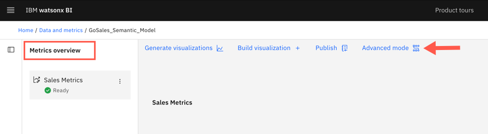

---
copyright:
  years: 2025
lastupdated: "2026-02-06"

keywords: best practices, tips for watasonx BI, optimizing data
subcollection: watsonx-bi


---

{{site.data.keyword.attribute-definition-list}}


# Optimizing data for AI
{: #best_practices}

{{site.data.keyword.wxbia_full_notm}} is a powerful analytics tool that uses large language models (LLM) to run complex, multi-step BI queries on your data. While {{site.data.keyword.wxbia_short}} has contextual understanding of data and can quickly respond to your questions, the quality of data determines the quality of the LLM’s generated responses. {: #shortdesc}

To enhance the quality of the generated query and the final answer, it is important to provide clear and comprehensive context to the LLM.

The following factors are used by the LLM to understand questions and the context of your data
when generating query statements:

- Asset name
- Asset description
- Column name 
- Column description
- Column identifier
- Column data type, usage, aggregate, and nullable fields

- Sampled columns 

Here some things that you can do to prepare your data for use by AI.


## Create a variety of metrics 
{: #metric_variety}

Define a variety of metrics and ground answers in these standardized metric definitions for accuracy and consistency. {{site.data.keyword.wxbia_full_notm}} uses metrics and the underlying enriched metadata, that is used to define metrics, to answer your questions and provide insights.


## Add business terms
{: #tip_add_terms}

{{site.data.keyword.wxbia_short_cap}} comes with predefined business terms. These business terms act as metadata to enrich data assets so that AI can better understand your data and provide accurate responses to your questions.

If your organization's business terminology is different, **IBM Cloud account owners** and **Administrators** can consider adding business terms to provide additional context to watsonx BI about their organization's data. For more information, see [Business terms](/docs/watsonx-bi?topic=watsonx-bi-business_terms){: external}.


## Use unique names for data assets
{: #tip_unique_names}

To avoid ambiguity and confusion, use unique and descriptive names for data assets, including metrics.


## Each asset and column needs a display name and description
{: #tip_display_name}

Review the metadata enrichment results in the metric creation process to ensure each Asset and Column has a meaningful and accurate AI-generated Display name and Description.

You can also access the metadata enrichment from the Project asset tab by selecting the relevant metadata enrichment asset.

You can accept the AI-suggested name and description or click **Edit** to add your own.

{: caption="Metadata enrichment review page displays the AI generated terms and assignments." caption-side="bottom"}

When you edit the **Display name** or **Description** in the metadata enrichment asset, the updates might get overwritten if enrichment is run again or if a metric definition is deleted or edited and exported. To avoid this, it is recommended to make your changes in the semantic data model instead (see #2 in the section below).
{: important}

When the confidence score of an AI-suggested name or description does not exceed the minimum threshold, the corresponding cell is blank. In that case, click the pencil icon next to the suggestion and provide a meaningful name or description for that asset or column.

Descriptions must be concise and reflect the purpose of the column. During query generation in a conversation, the AI uses both the identifier, name, and description (potentially with sampled data) to select the best columns to answer the question. Avoid repetitive descriptions, where every description includes the same text, especially when the repeated content is how users will frequently ask questions.
{: tip}


## Model data in the semantic model to help query generation
{: #tip_model}

### 1. Add clear column identifiers
{: #tip_identifiers}

To help the LLM understand the table schema correctly and easily, you need to ensure that the column identifiers are unique and clearly worded. 

Identifiers identify objects and are used to generate SQL queries in expressions. 

Column identifiers should be worded in a way that aligns with how users are likely to ask questions.

For example, if an asset is about product sales or revenue, column identifier “SALES_YEAR”/”SALES_DATE” would work better than “CURRENT_YEAR”/”CURRENT_DATE”, as it describes what the temporal columns represent. Similarly, if the asset is about sales target, use column identifiers such as “SALES_TARGET_YEAR“/”SALES_TARGET_DATE”.

On the other hand, when multiple fact metrics come into play (for example, revenue + planned revenue in a single metric definition with a shared time dimension), having more general temporal column identifiers might be beneficial.

To change the column identifier in a metric definition:

1. On the **Data and Metrics** tab, open the semantic data model that has the metric definition you want to edit.

2. Click **Advanced mode** on the **Metrics overview** page.

  

3. Under the metric definition, select the column you want to add the identifier to.

4. Open its **Properties** tab and scroll down to the **Advanced** section.

5. Enter the **Identifier** value. 

  An identifier's first character must be a letter or an underscore. Subsequent characters can be letters, numbers, or underscores, without spaces.
  {: tip}

  {: caption="A Properties panel displays the Column identifier field." caption-side="bottom"}

6. Under **Actions**, click **Save** to save the semantic data model.

7. Select the metric definition that you just made changes to and click **Export metric definition**. Exporting the metric definition runs metadata enrichment again and updates the existing metric, making it available for use in conversations.


### 2. Add column labels and descriptions
{: #tip_desc}

Make sure that you add a label and description for metric columns in the semantic data model. The order of priority for the label and description when used in the conversation is the following:

1. User-defined in the semantic data model

2. User-defined in the metadata enrichment asset

3. AI-suggested or generated in the metadata enrichment asset

Ensure that the label and description are worded based on your business context and how users will likely ask questions.

Descriptions need to be 512 characters or less to ensure a balance between accuracy and effectiveness.
{: important}

Include values in the description to specify time periods
:   For example: If months are represented as “Jan”, “Feb”, “Mar”, include that in the description. *“Month values are abbreviated as Jan, Feb, Mar...”*

If values follow a known standard, mention the standard name in the description
:   For example: *“Country codes follow ISO 3166 standard”* or *“Currency codes use ISO 4217”*

Reflect user language preferences
:   For example: If there is a column called "manager”, but your business users use the word "boss" then reflect that in the description. 
  
:   If you want AI to use "Cost of goods sold" column to answer questions about "Cost breakdown", then add that phrase to the description of the column.

To add column labels and descriptions in the semantic data model, follow these steps:

1. On the **Data and Metrics** tab, open the semantic data model that has the metric definition you want to edit.

2. Click the **Advanced mode**.

3. Under the metric definition, select the column you want to add a display name and description to.

4. Open its **Properties** tab and enter the name in the **Label** field and description in the **Description** field.

5. Under **Actions**, click **Save** to save the semantic data model.

6. Select the metric definition that you just made changes to and click **Export metric definition**.

### 3. Review column “Usage”, “Aggregate” and “Nullable” fields 
{: #tip_fields}

In the semantic data model, check the column properties to ensure that the **Usage**, **Aggregate**, and **Supports NULL values** fields for each column are correct.

- Usage: This property applies to tables and controls how the query engine understands and processes the table, and its child objects, in a query. 

- Aggregate: This property applies to columns, and defines the type of aggregation that is applied to a summary column.

- Supports NULL values:  Specifies whether a column supports null values. By default, this property value is inherited from the source. You can change this value.

For example, for a numerical column called Revenue, the **Usage** field should be **Measure**, rather than **Attribute**. If the sum of the revenue is commonly used in a question, the default **Aggregate** should be **Total**, rather than **Average**.

Sometimes data like “unit_cost” or “unit_sale_price” is treated like a **Measure**. However, these are actually attributes of a product.

{: caption="An open Properties panel displays the usage, aggregate, and null value fields." caption-side="bottom"}

### 4. Add instructions and context for AI
{: #add_instructions_context}

Use the **AI instructions and context** field to provide instructions and context that the LLM follows when it interprets and answers questions about a specific metric. This field helps standardize complex business logic and reduce ambiguity.

To add or modify instructions for a metric:

1. Open the metric’s menu in **Advanced mode** and select **Edit metric definition**.

2. Go to the **Details** tab.

3. Enter or update your plain text instructions directly in the **AI instructions and context** field.

4. Save the semantic data model.

5. From the metric's menu, select **Export metric definition** to apply the instructions to the metric in the project.

This field supports plain text and a maximum of 10,000 characters. You can also add your instructions in Markdown though plain text is preferred for clarity. 

#### How AI instructions are used 
{: #use_instructions}

The instructions that you provide, apply to only the metric where the instructions are defined. Use AI instructions in scenarios where consistent interpretation depends on rules, such as when:

- Your dataset uses business‑specific terminology that differs from column names

- You use standard calculation methods or rules, such as weighted averages or variance formulas

- Certain columns must always appear together for context

- You rely on default filters or display preferences

- You need to enforce organizational reporting standards, such as fiscal or seasonal time logic

When you ask a question about a metric that has instructions, {{site.data.keyword.wxbia_short}} notifies the LLM that the metric has custom rules and applies the rules during interpretation. 

Watsonx BI produces an SQL that aligns with expected patterns and validated behaviors.

#### Best practices for AI instructions
{: #tips_ai_instructions}

The instructions that you provide in watsonx BI are for AI systems, not humans. Prioritize directness and conciseness over grammar.
{: important}

| Best practice | Details |
|-------|-------------|
|Enter context-specific instructions only|Enter instructions or helpful context directly into the field without an introduction. <br> <br> Avoid: "Follow these rules" or "These are instructions you must follow for every question." | 
|Define the exact behavior and avoid vague directions| To reference columns, remember to use the column identifier. <br><br> Use: “Always include retailer_city and retailer_type_en.” <br><br>Avoid: “Include relevant columns”|
|Use consistent terminology|For example, if you choose a term such as “current,” use it consistently throughout the instructions.|
|Avoid conflicting rules|Ensure the instructions do not contradict each other. Review them together for alignment.|
|Don’t assume prior knowledge and define all required formulas and logic explicitly| Use: “Calculate margin as (Total Gross Profit / Total Revenue) × 100.”<br><br> Avoid: “Use the standard margin calculation.” |
{: caption="Best practices for writing AI instructions"}


#### Examples of AI instructions
{: #examples_ai_instructions}


**Calendar or season logic**
```
Treat “current year” as the latest CalendarYear available in the data.

Interpret seasons as:
Winter = December, January, February
Spring = March, April, May
Summer = June, July, August
Fall = September, October, November

Use these definitions when users reference seasons.
```
{: codeblock} 

**Fiscal year interpretation**
```
The fiscal year starts in April and ends in March of the following calendar year.
When users reference a fiscal year (for example, FY2023), interpret it as April 2022–March 2023.
```
{: codeblock}

**Monthly headcount metric**
```
This table contains monthly headcount. Treat each month independently.

Without date filters:
Return SUM(headcount)
WHERE month_end_date = MAX(month_end_date)

For a specific month and year (for example, January 2025):
Return SUM(headcount)
WHERE EXTRACT(month FROM month_end_date) = 1
AND EXTRACT(year FROM month_end_date) = 2025
```
{: codeblock}

**Date and time-based filtering**
````
For data/time based analysis, use date_hired if the question is related to new employees or promotions. Use termination date for attrition related questions.
````
{: codeblock}

**Use instructions for semi-additive measures**
If you have a semi-additive measure in your data, such as headcount or inventory, which cannot always be aggregated, you can add these to **AI instructions and context** field to use the appropriate calculation based on the time dimension. 

For example, you might have headcount data on a monthly basis but if you want the headcount for the year, you cannot add monthly headcount to get the yearly total. In this case, the value from the last month of the year would yield the correct yearly headcount. 

You can include a description instructing the AI on how to calculate headcount for the year.

```
Use this employee_num for yearly headcount. The headcount for 2025 is the total headcount for December 2025.
```
{: codeblock}

For more examples, see [Adding instructions and context for AI](/docs/watsonx-bi?topic=watsonx-bi-instructions_ai){: external}.


### 5. Remove unnecessary columns from the data
{: #tip_remove}

Remove columns from metric definitions that might not be useful in answering questions by deleting them or hiding them from the base table or metric definition.

For example, if a metric definition contains both “COMPANY_KEY” and “COMPANY_ID” columns, the AI might have difficulty deciding which one to choose when generating the query. If a business user is likely to only ask for “COMPANY_ID”, remove “COMPANY_KEY” column from the metric definition or hide it. Any columns that you hide, appear in grey and are moved to the bottom of the semantic model panel.

If you have multiple language-specific versions of the same column, such as the “PRODUCT_TYPE_” columns in the example below, you can create a new unified “PRODUCT_TYPE” column with an expression that can automatically pick the appropriate language-specific version, and hide the other redundant “PRODUCT_TYPE_” columns.

{: caption="A calculations displays in the Expression editor." caption-side="bottom"}


### 6. Ensure data quality 
{: #tip_quality}

Ensure that column values are correct and relevant.

Sampled column values are used by the LLM to construct well-formed filters. When you ask a question, watsonx BI’s NER step extracts filter values from the question, converts them into embeddings, and compares the filter embeddings with the columns’ sampled embeddings that are stored in Cloud Object Storage (COS). The matched sampled columns feed in to the prompt to help the LLM craft appropriate filter expressions, which are used in the WHERE clause of the final query statement.

For example, if a metric definition contains a “MONTH_NAME” column, the sampled values from that column should only contain valid month names.


### 7. Use column expressions for abstracting complex logic
{: #tip_expressions}

Use column expressions for calculations or transformations that encapsulate complex logic.

You can create column expressions in the semantic data model. Select a column and in the column properties, click the **View or edit** link in the **Expression** field. Add the necessary logic for this column to the Expression editor.Here is an example of an expression for the “EXECUTIVE_INDICATOR” column, which is a binary “Y” or “N” value that determined by the corresponding value in the BAND column.

{: caption="The View or edit link displays in the Expression field" caption-side="bottom"}

Let’s say you have a "Status" column with multiple cell values like "Todo", "In progress", 'Reviewing", "Icebox" and "Done". Your organization defines an open state as a status that is not in “Done” or “Icebox”. You can create a calculation column called “Is_open” and create an expression that returns “Y/N” based on the value from “Status” column, making it easier for the LLM understand the logic.

{: caption="A column expression displays in the Expression editor" caption-side="bottom"}

Give your expressions column identifiers that map to how your users will reference the data. For example, the "Is_open" expression we created, is a good name if this is how users refer to open or closed items. However, if users generally refer to items as active or inactive items then "Is_active" would be a better name.
{: tip}


### 8. Use column expressions to filter data
{: #tip_exp_filter}

Use column expressions to filter out unnecessary data from the metric definition before exporting it to create or update a metric.

{: caption="Semantic model panel shows a table with a filter applied to it." caption-side="bottom"}

For example, if a table includes product names in all languages and you only want the English names, you can add a filter to the table and apply it on the “product_language” column to filter out unnecessary values.

{: caption="A filter displays in the Expression editor." caption-side="bottom"}
