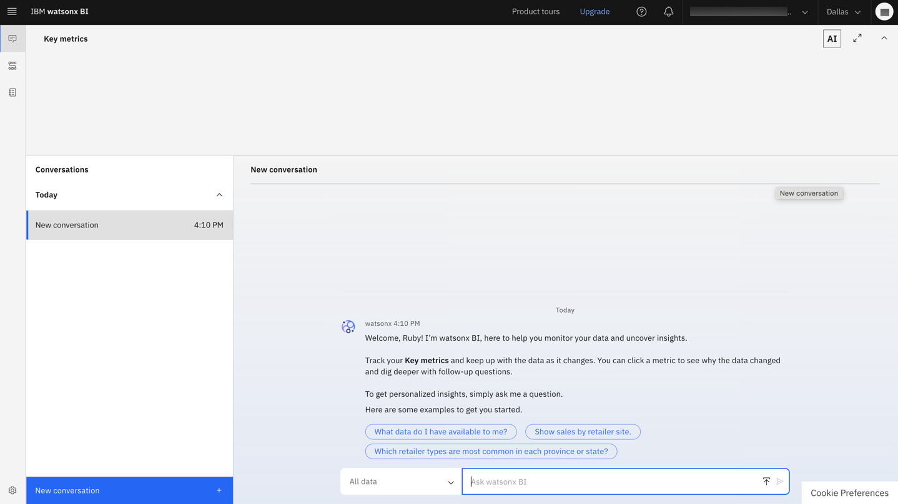

---
copyright:
  years: 2025
lastupdated: "2026-01-07"

keywords: quick start, provision, setup
subcollection: watsonx-bi

content-type: tutorial

---

{{site.data.keyword.attribute-definition-list}}

# Joining a watsonx BI account
{: #initializing_wxbi_nonadmin}
{: toc-content-type="tutorial"}

As an Administrator, Data analyst, or an Analytics consumer, you must be a member of your organization's IBM Cloud account before you can access your organization's watsonx BI account.

IBM Cloud account owners and account Administrators can invite Analytics consumers to join their organization's IBM Cloud account.{: #shortdesc}

If you have never created an IBM Cloud account, you will be asked to register an account when you first join your organization's IBM Cloud account. This is a one-time registration, after which you can be invited to any IBM Cloud account. You can also create an IBM Cloud account here: [http://cloud.ibm.com/](http://cloud.ibm.com/){: external} 

1. Click the **Join now** link in the email invite to join your organization's IBM Cloud account.

  

2. You are asked to log in with your IBMid. IBMids are assigned to IBM Cloud account members. If you have never created an IBM Cloud account, you are asked to register an account. This is a one-time registration. 

3. Confirm that your information is correct and click **Join account**. 

  

4. You are redirected to the home page of the IBM Cloud account that you were invited to. The Cloud account name displays in the header.

  

5. You can now access watsonx BI through this URL: [https://dataplatform.cloud.ibm.com/wxbi/conversations](https://dataplatform.cloud.ibm.com/wxbi/conversations){: external}

  When you use {{site.data.keyword.wxbia_short}}, make sure that the selected account in the account switcher in the header is the one that has access to {{site.data.keyword.wxbia_short}}. 
  {: note}

6. Initialize setup of watsonx BI.

7. (Optional) Select a prebuilt sample that you want to install. A project for the selected sample is created during installation.

  Data analysts and Analytics consumers - Samples are a great resource to explore prebuilt metrics and semantic data models. If you choose to skip installing samples, you won't be able to access them later. 
  {: important}

  

After watsonx BI's setup is complete, you are redirected to watsonx BI's **Conversations** page. If you were added as a collaborator to an existing project, you can start asking questions about the data in that project.

## Troubleshooting 
{: #troubleshooting_setup}

 Here's a look at how to troubleshoot errors that you might encounter as you set up {{site.data.keyword.wxbia_short}}:

- **Error: You don't have access to {{site.data.keyword.wxbia_short}}. Contact your administrator to request access.**

  You might see this error if: 

  | Scenario | Action  |
  |-------|-------------|
  | You are part of a Cloud account that does not have access to {{site.data.keyword.wxbia_short}} | The Cloud account owner must provision an instance of {{site.data.keyword.wxbia_short}} in the account and set it up before you can use {{site.data.keyword.wxbia_short}}. |
  | You are part of a Cloud account with access to {{site.data.keyword.wxbia_short}} but you do not have access| Administrator must give you access to {{site.data.keyword.wxbia_short}} |
  | {{site.data.keyword.wxbia_short}} is provisioned but not set up in the Cloud account | The Cloud account owner must set up {{site.data.keyword.wxbia_short}} before users in the account can use {{site.data.keyword.wxbia_short}}. | 
  {: caption="Access errors when setting up {{site.data.keyword.wxbia_short}}" caption-side="bottom"}

- **Error: Unable to connect to {{site.data.keyword.wxbia_short}} with the current account [account name]. If this is the one you want to work with, please contact your administrator. Otherwise select the right one from the account list in the header.**

  You might see this error if: 

   | Scenario | Action  |
   |-------|-------------|
   | You are a part of a Cloud account with access to {{site.data.keyword.wxbia_short}}, but your access was removed | The Cloud account owner can assign access to you for {{site.data.keyword.wxbia_short}}.|
   | You are a part of the Cloud account with access to {{site.data.keyword.wxbia_short}} but {{site.data.keyword.wxbia_short}} has not been set up on the account| The Cloud account owner must set up {{site.data.keyword.wxbia_short}} before you can use it.|
   |You are a part of multiple Cloud accounts and are trying to use {{site.data.keyword.wxbia_short}} with an account that doesn't have access | Select the right account in the account switcher that has access to {{site.data.keyword.wxbia_short}} and try again.
   {: caption="Access errors when setting up {{site.data.keyword.wxbia_short}}" caption-side="bottom"}

### How do I find my IBM Cloud account owner? 
{: #find_account_owner}

To find your Cloud account owner:

1. From the **Navigation Menu**, choose **Administration > Access (IAM)**.

2. From the avatar menu, make sure you're in the right account, or switch accounts, if necessary.

3. Click **Users**, and find the username with the word **owner** next to it.

## Accessing watsonx BI after setup
{: #access_after_setup}

To resume work in watsonx BI after logging out:

1. Go to [https://dataplatform.cloud.ibm.com/wxbi/conversations](https://dataplatform.cloud.ibm.com/wxbi/conversations){: external}.

2. Select the **Dallas (us-south)** region.

3. Log in with your IBMid. 

## Next steps
{: #next-join}

Familiarize yourself with [watsonx BI's user interface](/docs/watsonx-bi?topic=watsonx-bi-user_interface){: external}. 

If you're working with data (Data analyst), you can connect to a data source and start creating metrics. For more information, see [Creating metrics for conversations](/docs/watsonx-bi?topic=watsonx-bi-data_analysts_overview){: external}. 

If you want to ask questions about your data, start a conversation. For more information, see [An overview of conversations](/docs/watsonx-bi?topic=watsonx-bi-conv_overview){: external} and [Asking questions in natural language](/docs/watsonx-bi?topic=watsonx-bi-ask){: external}. 

