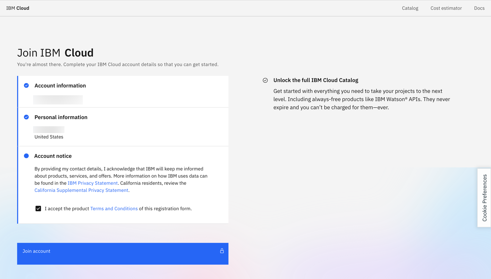
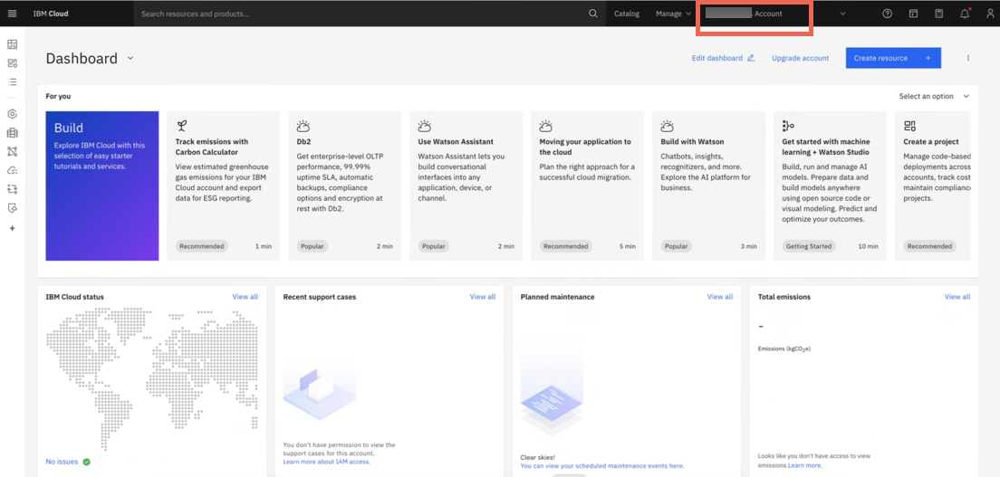
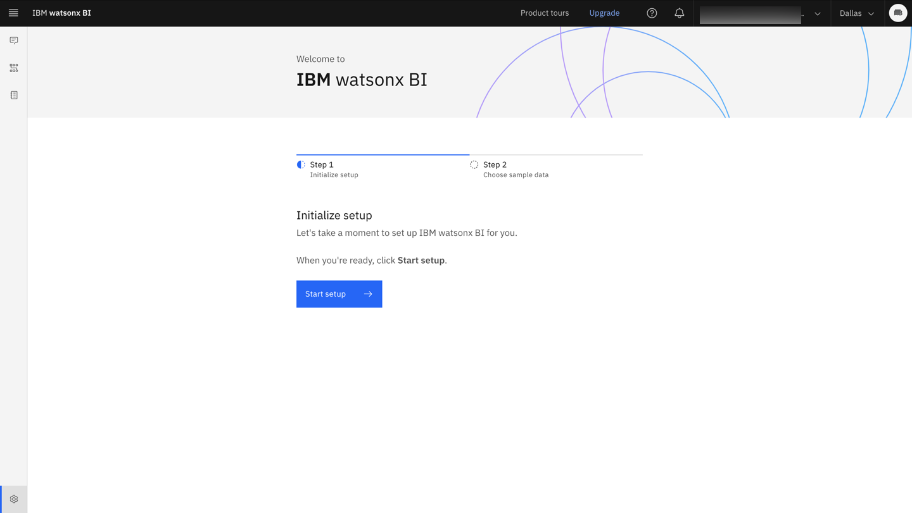
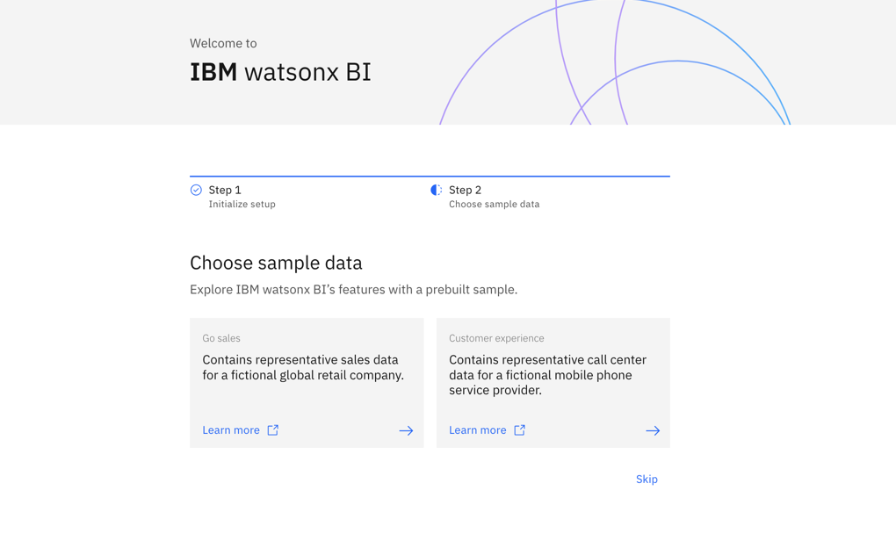
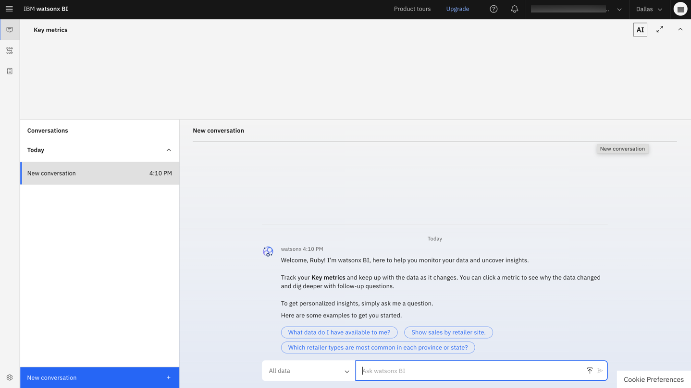

---
copyright:
  years: 2025
lastupdated: "2025-09-09"

keywords: quick start, provision, setup
subcollection: watsonx-bi

content-type: tutorial

---

{{site.data.keyword.attribute-definition-list}}

# Provisioning {{site.data.keyword.wxbia_short}}
{: #getting-started}
{: toc-content-type="tutorial"}

All users need to sign up for {{site.data.keyword.wxbia_full_notm}} in the IBM Cloud account. If you do not have an IBM Cloud account, you can create one here: [http://cloud.ibm.com/](http://cloud.ibm.com/){: external} {: #shortdesc}

As an Administrator, Data analyst, or an Analytics consumer, you must be a member of your organization's IBM Cloud account before you can access your organization's watsonx BI account. 

IBM Cloud account owners and account Administrators can invite users to join their organization's IBM Cloud account.

## IBM Cloud account owners
{: #account_owner}

These steps describe the typical tasks for an IBM Cloud account owner to set up the account for an organization:

### Step 1: Provision {{site.data.keyword.wxbia_short}} in your Cloud account
{: #step1}

You can provision {{site.data.keyword.wxbia_short}} by creating an instance of the service in your IBM Cloud account.

1. Log into your IBM Cloud account. 

2. Click **Create resource**.

3. Select **{{site.data.keyword.wxbia_short}}** from the catalog.

4. Select a pricing plan, accept the license agreement checkbox, and click **Create**. 

The new service instance appears under **AI/Machine learning** in the **Resource list**. 

### Step 2: Set up and initialize {{site.data.keyword.wxbia_short}}
{: #step2}

As an IBM Cloud account owner, you must set up and initialize {{site.data.keyword.wxbia_short}} before other users that you invite to your Cloud account can use {{site.data.keyword.wxbia_short}}. This step cannot be delegated to an Administrative user. 
{: requirement}

1. From the **Resource list**, select and launch the {{site.data.keyword.wxbia_short}} instance. 

2. Click **Start setup**.

3. Select a [Cloud Object Storage](https://dataplatform.cloud.ibm.com/docs/content/svc-welcome/cloud-object-storage.html?context=cpdaas&context=cpdaas&context=dph&context=analytics&context=cpdaas&context=analytics&context=analytics&context=analytics&context=cpdaas&context=analytics&context=cpdaas&context=analytics&context=analytics&context=analytics&context=cpdaas&context=analytics&context=analytics&context=cpdaas&context=cpdaas&context=analytics&context=analytics&context=dph&context=analytics&context=analytics&context=cpdaas&context=cpdaas&context=analytics&context=cpdaas&context=analytics&context=analytics&context=dph&context=cpdaas&context=analytics&context=analytics&context=analytics&context=analytics&context=cpdaas&context=analytics&context=analytics&context=analytics&context=analytics&context=cpdaas&context=cpdaas&context=analytics&context=analytics&context=cpdaas&context=cpdaas&context=analytics&context=analytics&context=cpdaas&context=cpdaas&context=analytics&context=analytics&context=analytics&context=dph&context=cpdaas&context=analytics&context=cpdaas&context=analytics&context=analytics&context=analytics&context=analytics&context=cpdaas&context=dph&context=cpdaas&context=cpdaas&context=analytics&context=analytics&context=analytics&context=cpdaas&context=analytics&context=analytics&context=analytics&context=analytics&context=analytics&context=analytics&context=dph&context=cpdaas&context=cpdaas&context=cpdaas&context=analytics&context=analytics&context=analytics&context=analytics&context=analytics&context=cpdaas&context=analytics&context=analytics&context=cpdaas&context=cpdaas&context=analytics&context=cpdaas&context=cpdaas&context=analytics&context=dph&context=analytics&context=analytics&context=cpdaas&context=analytics&context=cpdaas&context=cpdaas&context=cpdaas&context=analytics&context=cpdaas&locale=en&audience=wdp&audience=wdp&audience=wdp&audience=wdp&audience=wdp&audience=wdp&audience=wdp&audience=wdp&audience=wdp&audience=wdp&audience=wdp&audience=wdp&audience=wdp&audience=wdp&audience=wdp&audience=wdp&audience=wdp%253Fcontext%253Dcpdaas){: external} instance and click **Next**.  

4. (Optional) Choose a [sample](/docs/watsonx-bi?topic=watsonx-bi-using_samples){: external} to set up in your {{site.data.keyword.wxbia_short}} instance. 

5. [Invite users](/docs/watsonx-bi?topic=watsonx-bi-add_users_account){: external} to use your instance of {{site.data.keyword.wxbia_short}}. After the invited users join the account, you can: 

    a. add users to the watsonx BI community and assign relevant collaborator roles: Administrator, Data analyst, or Analytics consumer

    b. add users as collaborators to projects 

During the instance setup, {{site.data.keyword.wxbia_short}} enables access delegation for the selected Cloud Object Storage instance. This grants any user of your account the permission to create their own projects and build their metrics.
{: note}

When you use {{site.data.keyword.wxbia_short}}, make sure that the selected account in the account switcher in the header is the one that has access to {{site.data.keyword.wxbia_short}}. 

## Administrators, Data analysts, and Analytics consumers
{: #users}

Once the IBM Cloud account owner has set up {{site.data.keyword.wxbia_short}}, all other users that were invited by the account owner to their account, can now set up the service. 

1. Click the **Join now** link in the invite. 

2. You are asked to log in with your IBMid. IBMids are assigned to IBM Cloud account members. If you have never created an IBM Cloud account, you are asked to register an account. This is a one-time registration, after which you can be invited to any IBM Cloud account. 

3. Confirm that your information is correct and click **Join account**. 

  

4. You are now on the home page of the IBM Cloud account that you were invited to and can see the Cloud account name in the header.

  

5. You can now access watsonx BI through this URL: [https://dataplatform.cloud.ibm.com/wxbi/conversations](https://dataplatform.cloud.ibm.com/wxbi/conversations){: external}

  When you use {{site.data.keyword.wxbia_short}}, make sure that the selected account in the account switcher in the header is the one that has access to {{site.data.keyword.wxbia_short}}. 
  {: note}

6. You are prompted to initialize setup. 

7. (Optional) Select a prebuilt sample that you want to install. A project for the selected sample is created during installation.

  Data analysts and Analytics consumers - If you choose to skip installing samples, you won't be able to access them later. Samples are a great resource to explore prebuilt metrics and semantic data models. 
  {: important}

  

After watsonx BI's setup is complete, you are redirected to watsonx BI's **Conversations** page. 

## Troubleshooting
{: #troubleshooting_setup}

 Here's a look at how to troubleshoot errors that you might encounter as you set up {{site.data.keyword.wxbia_short}}:

- **Error: You don't have access to {{site.data.keyword.wxbia_short}}. Contact your administrator to request access.**

  You or a user you invited to the Cloud account might see this error if: 

  | Scenario | Action  |
  |-------|-------------|
  | As a Cloud account owner, you do not have access to {{site.data.keyword.wxbia_short}} | Follow Steps 1 and 2 above to provision an instance and set up {{site.data.keyword.wxbia_short}}. |
  | You are part of a Cloud account that does not have access to {{site.data.keyword.wxbia_short}} | The Cloud account owner must provision an instance of {{site.data.keyword.wxbia_short}} in the account and set it up before you can use {{site.data.keyword.wxbia_short}} (Steps 1 and 2 above). |
  | You are part of a Cloud account with access to {{site.data.keyword.wxbia_short}} but you do not have access| Administrator must give you access to {{site.data.keyword.wxbia_short}} |
  | {{site.data.keyword.wxbia_short}} is provisioned but not set up in the Cloud account | The Cloud account owner must set up {{site.data.keyword.wxbia_short}} before users in the account can use {{site.data.keyword.wxbia_short}} (see Step 2). | 
  | {{site.data.keyword.wxbia_short}} has not been provisioned at all | Follow Steps 1 and 2 above to provision an instance and set up {{site.data.keyword.wxbia_short}}.|
  {: caption="Access errors when setting up {{site.data.keyword.wxbia_short}}" caption-side="bottom"}

- **Error: Unable to connect to {{site.data.keyword.wxbia_short}} with the current account [account name]. If this is the one you want to work with, please contact your administrator. Otherwise select the right one from the account list in the header.**

  You or a user you invited to the Cloud account might see this error if: 

   | Scenario | Action  |
   |-------|-------------|
   | You are a part of a Cloud account with access to {{site.data.keyword.wxbia_short}}, but your access was removed | The Cloud account owner can assign access to you for {{site.data.keyword.wxbia_short}}.|
   | You are a part of the Cloud account with access to {{site.data.keyword.wxbia_short}} but {{site.data.keyword.wxbia_short}} has not been set up on the account| The Cloud account owner must set up {{site.data.keyword.wxbia_short}} before you can use it (see Step 2).|
   |You are a part of multiple Cloud accounts and are trying to use {{site.data.keyword.wxbia_short}} with an account that doesn't have access | Select the right account in the account switcher that has access to {{site.data.keyword.wxbia_short}} and try again.
   {: caption="Access errors when setting up {{site.data.keyword.wxbia_short}}" caption-side="bottom"}

## Next steps
{: #next_provision}

- [Adding users to the account and assigning roles](/docs/watsonx-bi?topic=watsonx-bi-add_users_account)

- [Roles and permissions in {{site.data.keyword.wxbia_short}}](/docs/watsonx-bi?topic=watsonx-bi-roles)
