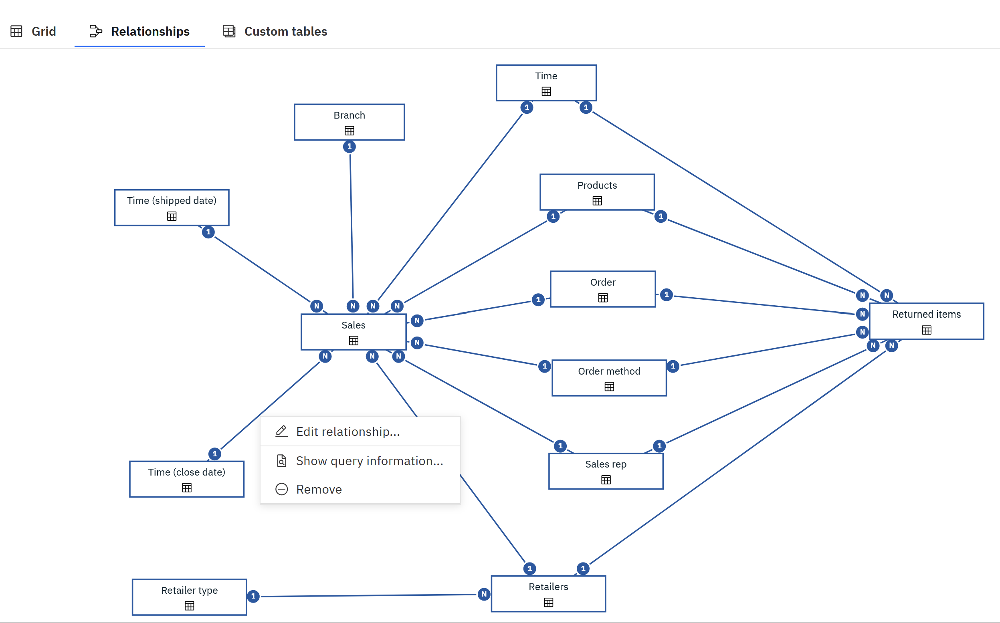

---
copyright:
  years: 2025
lastupdated: "2026-01-07"

keywords:
subcollection: watsonx-bi

---

{{site.data.keyword.attribute-definition-list}}

# Relationships
{: #relationships}

A relationship joins logically related tables that you want to combine in a single query.{: #shortdesc}

{{site.data.keyword.wxbia_full_notm}} automatically detects relationships between tables in a semantic data model by using the auto-join algorithm. 

You can modify or delete relationships, or create new ones so that the semantic data model properly represents the logical structure of your business. Verify that the relationships that you require exist in the semantic data model, the cardinality is set correctly, and referential integrity is enforced.

You cannot define relationships on metric definitions. Relationships can be defined only on the underlying base tables of a metric definition. 
{: important}

The **Relationships** diagram provides a graphical view of table relationships in a semantic data model. The relationships are represented by solid lines between tables. You can use the diagram to examine, create, and edit the relationships.

{: caption="Relationships tab shows the relationships between tables." caption-side="bottom"}

## Automatic joins
{: #auto_join}

The auto-join (automatic join) algorithm adopts a diagnostic scoring approach when deciding which columns to use to join two tables. 

The algorithm uses a set of rules that are applied when choosing the column combinations between the two tables. Each rule produces a score. The score could be negative. The total score of all rules decides if a column combination qualifies to be a join column.

The auto-join algorithm uses the following rules:

- The similarity of two column names must exceed a minimum threshold.
  
  For example, the names SalesCountryCode and CountryCode are highly similar, and can be considered a match.

- Both columns belong to the same semantic category.

  For example, the Employee or Product category.

- Both columns have the same semantic attribute.

  For example, both are IDs.

- None of the columns is a common row identifier.

  The row ID column could be in every table.

- The data in two numeric columns overlaps.

  The relationship between two columns can't be many-to-many.
  
A join relationship is created if any column combinations between two tables satisfy a minimum qualification score. The collected statistics are used to ensure that cardinality is properly set when building the relationship. The joins created by the auto-join algorithm are saved as the inferred relationships in the semantic data model.

## Join operators
{: #join_operators}

Join operators are used when creating or editing relationships to specify the type of match between columns that are joined in a relationship.

By default, values are compared by using the equal (=) operator. When you use an operator other than equal (=), you create joins that are based on a range of values.

The following join operators are supported:

- Equal (=)

  Values in the left and right columns are identical or similar. The values are considered similar when they have a different data type, accent, or case. For example, the following values are considered similar:
  
  - Renee, RENEE, and Renée

  - String "123" and integer 123

- Less than (<)

  Values in the left column are less than values in the right column.

- Greater than (>)

  Values in the left column are greater than values in the right column.

-  Less than or equal (<=)

  Values in the left column are less than or equal to values in the right column.

- Greater than or equal (>=)

  Values in the left column are greater than or equal to values in the right column.

- Less than and greater than (< >)

  Values in the left and right columns are different.

- =N

  Values in the left and right columns are equal, even if both values are null.

## Creating a relationship manually
{: #create_rel_manual}

You might need to create relationships when they are not automatically detected by {{site.data.keyword.wxbia_short}}.

The Relationships diagram is the most convenient place to view all semantic data model relationships, and quickly discover the disconnected tables.

1. In the semantic model tree or in the diagram, click the table for which you want to create a relationship, and from the table context menu, click **New > Relationship**.

   You can also start creating a relationship by control-clicking the two tables that you want to join in a relationship, and click **Relationship**. On the **Relationships** tab in the table properties, click **Add a relationship**.
  {: tip}

2. In the **Create relationship** dialog box, select the second table to include in the relationship.
Depending on the method that you used to start the relationship, the second table might already be added, and you only need to match the columns.

3. Find the matching columns in both tables, and select **Match selected columns**. For example, you can match on Product id columns. The matching columns are highlighted in the data grid. You might need to click **Refresh** to retrieve the data.

4. Click **Matched columns** to specify the join operator for the match.

   In the **Defined matches** dialog box, select a join operator. By default, columns are matched based on similar values, by using the equal (=) operator. However, you can also match columns based on a range of values by choosing a different join operator. 

5. Click the relationship settings icon. By default, the relationship settings are detected from the source.

    Review, and if needed, modify the following settings:

    - Relationship Type - The following types can be specified: inner join, left outer join, right outer join, and full outer join.

    - Cardinality - The following types can be specified: 1-to-1, 1-to-many, and many-to-1.

    - Optimization - Use the optimization filters to reduce the number of rows of data that are retrieved when the join is executed.

6. Click **OK**.

The new relationship appears on the **Relationships** tab in the properties page of the tables that you joined, and in the diagram view.

## Generating auto-relationships
{: #generate_auto_rel}

You can automatically generate new relationships between tables in a semantic data model. 

This feature has the following benefits:

- Reduces the effort that is required to identify related tables and establish connections between them when creating relationships manually.

- Reveals relationships that users might not have originally considered.

- Enhances the overall efficiency and depth of relationship discovery.

Relationships are automatically detected between the assets in a project. {{site.data.keyword.wxbia_short_cap}} cannot detect relationships that include already modeled tables or columns in the semantic data model as they do not get exported to or enriched in the project.
{: note} 

To generate auto-relationships, follow these steps:

1. In the **Relationships** diagram, select one or more tables, and from their context menu, click **Auto-relationships**.

   - If you initiate auto-relationships for one table, when the relationship discovery is successfully completed, the toast message shows the number of generated relationships, and the new relationships are visible in the Relationship diagram.

   - If you initiate auto-relationships for two or more tables, a dialog box is displayed where you can decide to include or exclude other tables in the semantic data model. This helps to limit the discovery of relationships to the tables that you selected. Then, click **Generate**.

   After the discovery is successfully completed, the toast message shows the number of generated relationships, and the new relationships are visible in the Relationship diagram.

2. Save the semantic data model.

## Managing relationships
{: #manage_rel}

To view or edit all relationships defined for a table, go to the **Relationships** tab in the table properties. Click the relationship link, and make the modifications. 

To view a relationship from the diagram, click the join line to open a graphical view of the relationship. To edit a relationship from the diagram, right-click the join line, and click **Edit relationship**.

To delete a relationship for a table, go to the **Relationships** tab in the table properties, and click the remove icon remove icon for the required relationship. To delete the relationship from the diagram, right-click the line joining the two tables, and click **Remove**.

