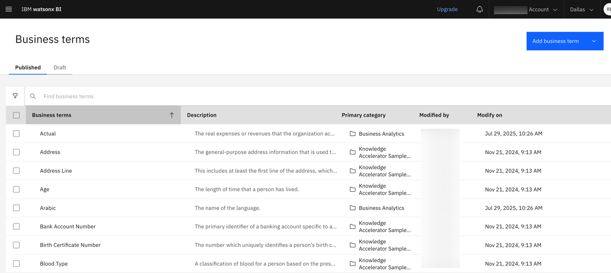
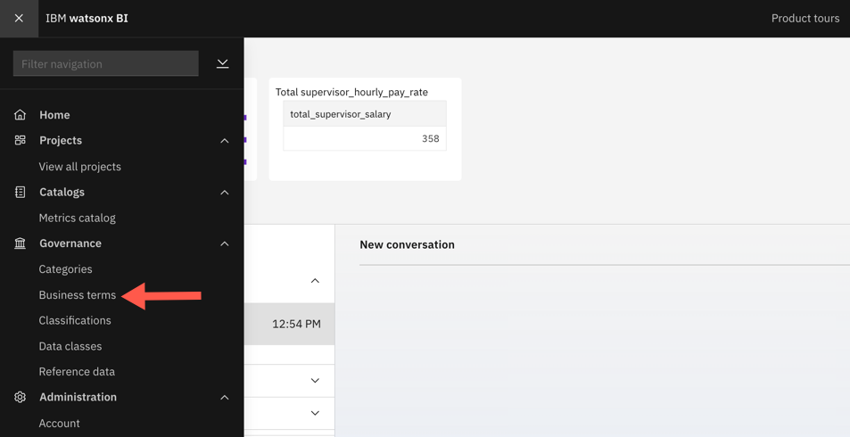
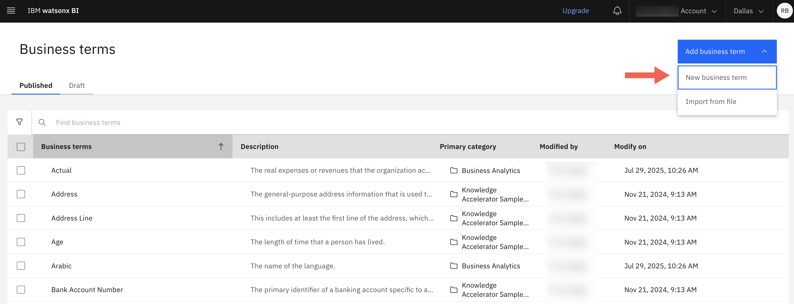
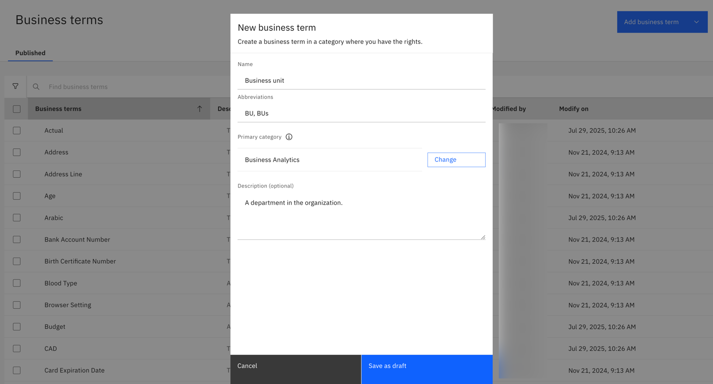
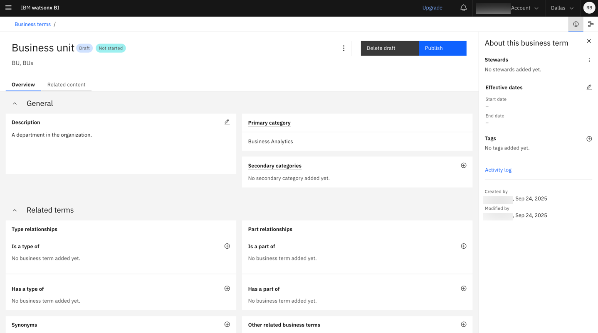
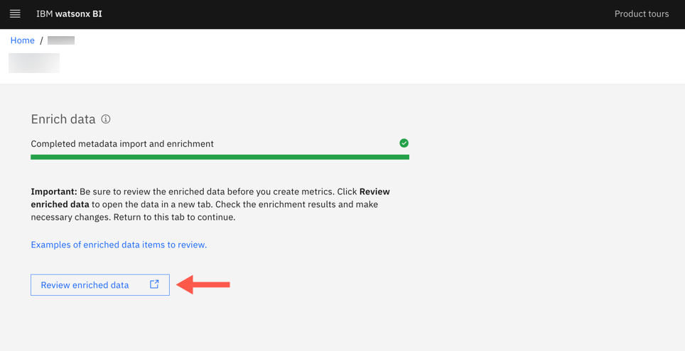
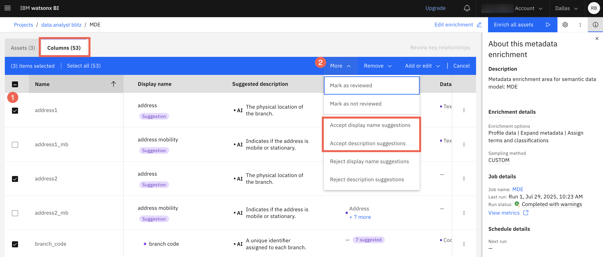
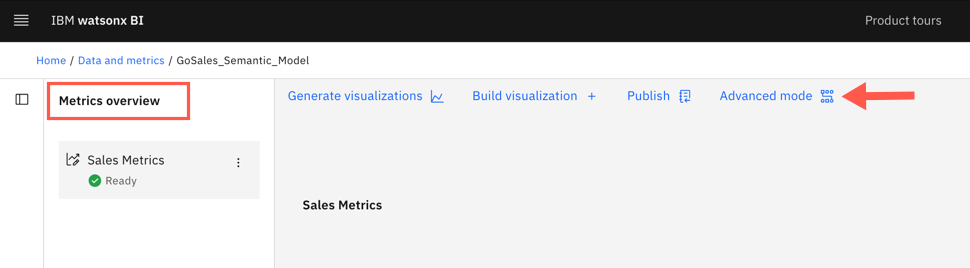
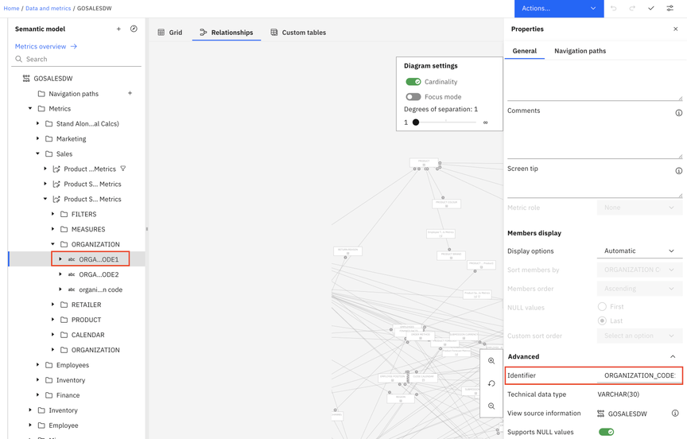
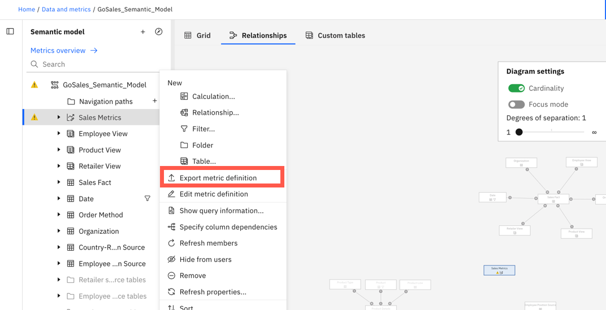

---
copyright:
  years: 2025
lastupdated: "2026-01-07"

keywords: teach watsonx bi, best practices, tips
subcollection: watsonx-bi

---

{{site.data.keyword.attribute-definition-list}}

# Teaching watsonx BI your business language
{: #teach_wxbi}

{{site.data.keyword.wxbia_full_notm}} uses the following to understand questions and the context of your data when generating query statements to respond:

- Asset name
- Asset description
- Column name 
- Column description
- Column identifier
- Column data type, usage, aggregate, and nullable fields
- Sampled columns 

The quality of this data determines the quality of watsonx BI’s generated responses. 

You can improve the quality of watsonx BI’s answers and teach it your business language with the following three methods: 

1. Adding your business glossary to watsonx BI’s business terms 

2. Ensuring each asset and column has a descriptive, meaningful, and accurate display name and description in the metadata enrichment

3. Adding context in the semantic data model to help query generation 

Let’s explore each one in detail.

## 1. Adding your business glossary in watsonx BI 
{: #add_glossary}

Watsonx BI comes with predefined business terms, which **Cloud account owners** and **Administrators** can find under **Navigation Menu > Governance > Business terms**.

As a Cloud account owner or Administrator, you can add your organization’s business glossary to the existing business terms in watsonx BI. 

These predefined business terms and any glossary concepts that you upload are one of the components that are used during metadata enrichment to augment technical metadata with more descriptive and meaningful names.

Consider adding your organization’s business glossary right after you setup and initialize watsonx BI so that watsonx BI can use these terms when the source data undergoes metadata enrichment.
{: tip}

### Steps to add new business terms
{: #steps_business_terms}

You can add business terms one by one or upload a CSV file. 

In order for watsonx BI to use the business terms that you’ve added, the source data has to undergo metadata enrichment. 
{: important}

To add a new business term:

1.	Go to **Navigation Menu > Governance > Business terms**.

  

2.  Click **Add business term** and select **New business term**.

  

3.	Enter the business term and related details. Ensure that **Business Analytics** is selected in the **Primary category** field.

 

4.	Click **Save as draft**. 

5.	(Optional) On the **Overview** tab, you can add synonyms and define relationships with other business terms.

  

6.	Click **Publish**.

To import business terms from a CSV file:

1.	Go to **Navigation Menu > Governance > Business terms**, click **Add business term** and select **Import from file**.

2.	Upload the file and choose a method for merging imported and existing artifacts.

3.	On the **Task inbox** page, review the imported business terms.

4.	Click **Publish**.

## 2. Providing accurate display names and descriptions in metadata enrichment
{: #add_display_name}

[Metadata enrichment](/docs/watsonx-bi?topic=watsonx-bi-enrich){: external} in watsonx BI uses generative AI with IBM watsonx.data intelligence to understand your data on a deeper level.

Traditional or simple data might lack clear meaning or context. Metadata enrichment uses AI to analyze the data and adds a semantic layer of well-defined business context such as business terms, descriptions, and categories to the data. 

Metadata enrichment takes place during the [metric creation process](/docs/watsonx-bi?topic=watsonx-bi-data_analysts_overview){: external}. Each asset and column undergoes metadata enrichment during which metadata is expanded, business terms and classifications are suggested and assigned, descriptions are generated, and more. 

Metadata enrichment is used as a starting point to create and populate the semantic data model.
{: important}

After metadata enrichment completes, click **Review enriched data** to review the enrichment results: 

When you open the enrichment results, you can view the enriched data at both the asset level and column level. Here, you need to:

1. Review the enrichment results to ensure each asset and column has a meaningful display name and description. 

2. Accept the AI-suggested name and description or click **Edit** to add your own. 

  A name or description might already be assigned because the confidence was high enough or it is a suggestion that you can accept. 

If you edit the **Display name** or **Description** in the metadata enrichment, the updates might get overwritten if enrichment is run again or if a metric definition is deleted or edited and exported. To avoid this, make your changes and add context in the semantic data model instead (see subsequent section).
{: important}

To accept the suggested and assigned details for assets or columns: 

1.	Go to the **Assets** or **Columns** tab and select one or more items. To select all assets or columns, click the checkbox next to **Name**.

2.	Click **More** and choose the type of suggestion that you want to accept.

## 3. Adding context in the semantic data model to help query generation 
{: #add_context_semantic_model}

After metadata enrichment in watsonx BI, a semantic data model is created automatically that defines relationships between entities (e.g., customers, products, sales) in a way that reflects real-world business logic rather than physical database joins. 

The semantic data model also uses business context from the metadata enrichment to rename and organize tables, columns, and relationships, making it easier to understand the data. 

To further augment watsonx BI’s understanding of your data and business language, here are a couple of things you can add to the semantic data model:

### Clear column identifiers
{: #add_identifiers}

To help the watsonx BI understand the table schema correctly and easily, ensure that each column has an **Identifier** in the semantic data model.

These identifiers should be unique, clear, and worded in a way that aligns with how users are likely to ask questions.

For example, if an asset is about:

- Product sales or revenue, Column Identifier “SALES_YEAR”/”SALES_DATE” would work better than the vague “CURRENT_YEAR”/”CURRENT_DATE”, as it describes what the temporal columns represent.

- Sales target, use Column Identifiers such as “SALES_TARGET_YEAR“/”SALES_TARGET_DATE” to distinguish them from actual sales.

On the other hand, when multiple fact metrics come into play (for example, revenue + planned revenue in a single metric definition with a shared time dimension), having more general temporal column identifiers might be beneficial.

To add an identifier to a metric definition:

1. On the **Data and Metrics** tab, open the semantic data model that has the metric definition you want to edit.

2. Click **Advanced mode** on the **Metrics overview** page.

  

3. Under the metric definition, select the column you want to add the identifier to.

4. Open its **Properties** tab and scroll down to the **Advanced** section.

5. Enter the **Identifier** value.

  {: caption="A Properties panel displays the Column identifier field." caption-side="bottom"}

6. Under **Actions**, click **Save** to save the semantic data model.

7. Select the metric definition that you just made changes to and click **Export metric definition**. Exporting the metric definition runs metadata enrichment again and updates the existing metric, making it available for use in conversations.

  

### Meaningful column labels and descriptions
{: #add_label_desc}

You can add a label and description to a metric column in the semantic data model to help watsonx BI understand how users refer to data in natural language.

The order in which watsonx BI uses the display name and description to retrieve data is the following:

1. User-defined in the semantic data model

2. User-defined in the metadata enrichment asset

3. AI-suggested or generated in the metadata enrichment asset

To add a label and description to a metric column in the semantic data model:

1. On the **Data and Metrics** tab, open the semantic data model that has the metric definition you want to edit.

2. On the **Metrics overview** page, click **Advanced mode**.

  

3. Under the metric definition, select the column you want to add a display name and description to.

4. Open its **Properties** tab and enter a name in the **Label** field and description in the **Description** field. 

5. Under **Actions**, click **Save** to save the semantic data model.

6. Select the metric definition that you just made changes to and click **Export metric definition**.

  

You can now try asking questions against the metric definition directly from the **Metrics overview** page. To do this, click the menu icon next to the metric definition and select **Try in conversation**. 

This is an iterative process. If the responses aren’t as expected, revisit the semantic data model and add more context to improve understanding. 
{: note}

#### Creating strong descriptions
{: #write_desc}

Ensure that the name and description are worded based on your business context and how users will likely ask questions. For example:

- Include values in the description to specify time periods

  For example: If months are represented as “Jan”, “Feb”, “Mar”, include that in the description.
  *“Month values are abbreviated as Jan, Feb, Mar...”*

- If values follow a known standard, mention the standard name in the description

  For example: *“Country codes follow ISO 3166 standard”* or *“Currency codes use ISO 4217”*

- Reflect user language preferences

  For example: If there is a column called *"manager”*, but your business users use the word *"boss"*, then reflect that in the description. 
  
  If you want AI to use *"Cost of Goods Sold"* column to answer questions about *"Cost breakdown"*, then add that phrase to the description of the column. 

## Related links
{: #related}

- [Optimizing data for AI](/docs/watsonx-bi?topic=watsonx-bi-best_practices){: external}

