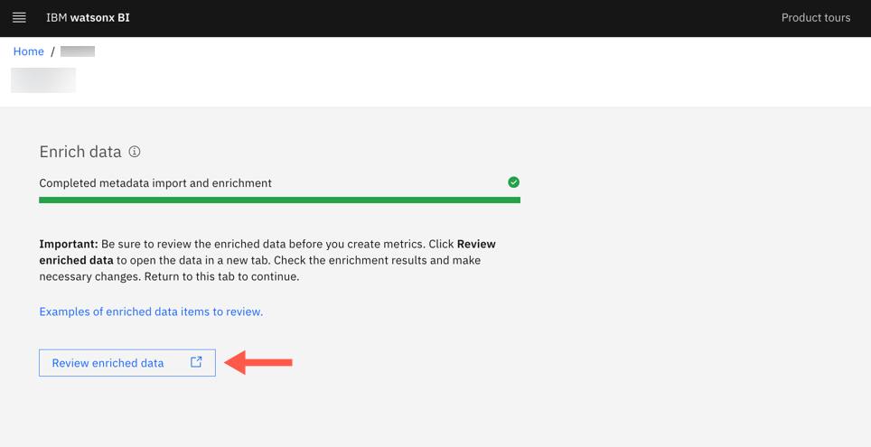
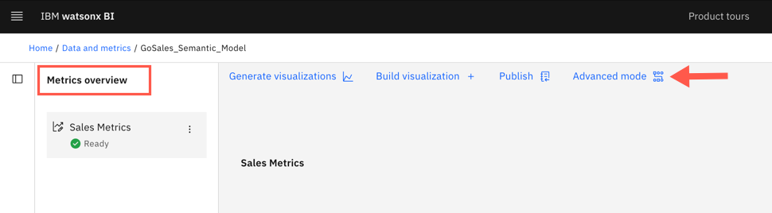
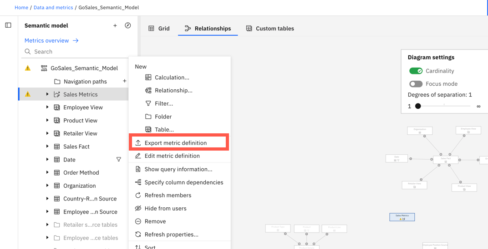

---
copyright:
  years: 2025, 2026
lastupdated: "2026-07-10"

keywords: teach watsonx bi, best practices, tips
subcollection: watsonx-bi

---

{{site.data.keyword.attribute-definition-list}}

# Teaching watsonx BI your business language
{: #teach_wxbi}

{{site.data.keyword.wxbia_full_notm}} uses the following to understand questions and the context of your data when it generates query statements to respond:

- Asset name
- Asset description
- Column name 
- Column description
- Column identifier
- Column data type, usage, aggregate, and nullable fields
- AI instructions and context
- Sampled columns 

The quality of this data determines the quality of the generated responses. 

You can improve the quality of watsonx BI’s answers and teach it your business language by making sure each asset and column has a descriptive, meaningful, and accurate display name and description. You can also add context in the semantic data model to help query generation.

## Providing accurate display names and descriptions in metadata enrichment
{: #add_display_name}

[Metadata enrichment](/docs/watsonx-bi?topic=watsonx-bi-enrich){: external} in watsonx BI uses generative AI to understand your data on a deeper level. Traditional or simple data might lack clear meaning or context. Metadata enrichment uses AI to analyze the data and adds a semantic layer of well-defined business context such as business terms, descriptions, and categories to the data. 

You can review the metadata enrichment results and make necessary changes to display names and descriptions if you use: 

- {{site.data.keyword.wxbia_short_cap}} on IBM Software Hub 
- Watsonx.data intelligence in watsonx BI as a Service for metadata enrichment 

A similar review page is not available in watsonx BI as a Service if you use using watsonx BI's native enrichment.
{: important}

The [enriched data results](/docs/watsonx-bi?topic=watsonx-bi-review){: external} open in a separate tab and any changes you make save automatically to the semantic data model. 

Here, you need to:

1. Review the enrichment results to ensure that each asset and column has a meaningful display name and description. 

2. Accept the AI-suggested name and description or click **Edit** to add your own. 

  A name or description might already be assigned because the confidence was high enough or it is a suggestion that you can accept. 

If you edit the **Display name** or **Description** in the metadata enrichment, the updates might get overwritten if enrichment is run again or if a metric definition is deleted or edited and exported. To avoid this issue, make your changes and add context in the semantic data model instead (see subsequent section).
{: important}

## Adding context in the semantic data model to help query generation 
{: #add_context_semantic_model}

After metadata enrichment in watsonx BI, a semantic data model is created automatically that defines relationships between entities (e.g., customers, products, sales) in a way that reflects real-world business logic rather than physical database joins. 

The semantic data model also uses business context from the metadata enrichment to rename and organize tables, columns, and relationships, making it easier to understand the data. 

To further augment watsonx BI’s understanding of your data and business language, here are a couple of things you can add to the semantic data model:

### Clear column identifiers
{: #add_identifiers}

To help the watsonx BI understand the table schema correctly and easily, ensure that each column has an **Identifier** in the semantic data model.

These identifiers must be unique, clear, and worded in a way that aligns with how users are likely to ask questions.

For example, if an asset is about:

- Product sales or revenue, Column Identifier “SALES_YEAR”/”SALES_DATE” would work better than the vague “CURRENT_YEAR”/”CURRENT_DATE”, as it describes what the temporal columns represent.

- Sales target, use Column Identifiers such as “SALES_TARGET_YEAR“/”SALES_TARGET_DATE” to distinguish them from actual sales.

On the other hand, when multiple fact metrics come into play (for example, revenue + planned revenue in a single metric definition with a shared time dimension), having more general temporal column identifiers might be beneficial.

To add an identifier to a metric definition:

1. On the **Data and Metrics** tab, open the semantic data model that has the metric definition you want to edit.

2. Click **Advanced mode** on the **Metrics overview** page.

  

3. Under the metric definition, select the column that you want to add the identifier to.

4. Open its **Properties** tab and scroll down to the **Advanced** section.

5. Enter the **Identifier** value.

  {: caption="A Properties panel displays the Column identifier field." caption-side="bottom"}

6. Under **Actions**, click **Save** to save the semantic data model.

7. Select the metric definition that you just changed and click **Export metric definition**. Exporting the metric definition runs metadata enrichment again and updates the existing metric, making it available for use in conversations.

  

### Meaningful column labels and descriptions
{: #add_label_desc}

You can add a label and description to a metric column in the semantic data model to help watsonx BI understand how users refer to data in natural language.

The order in which watsonx BI uses the display name and description to retrieve data is as follows:

1. User defined in the semantic data model

2. User defined in the metadata enrichment asset

3. AI-suggested or generated in the metadata enrichment asset

To add a label and description to a metric column in the semantic data model:

1. On the **Data and Metrics** tab, open the semantic data model that has the metric definition you want to edit.

2. On the **Metrics overview** page, click **Advanced mode**.

  

3. Under the metric definition, select the column that you want to add a display name and description to.

4. Open its **Properties** tab and enter a name in the **Label** field and description in the **Description** field. 

5. Under **Actions**, click **Save** to save the semantic data model.

6. Select the metric definition that you just changed and click **Export metric definition**.

  

You can now try asking questions against the metric definition directly from the **Metrics overview** page. To do this, click the menu icon next to the metric definition and select **Try in conversation**. 

This is an iterative process. If the responses aren’t as expected, revisit the semantic data model and add more context to improve understanding. 
{: note}

#### Creating strong descriptions
{: #write_desc}

Ensure that the name and description are worded based on your business context and how users ask questions. For example:

- Include values in the description to specify time periods

  For example: If months are represented as “Jan”, “Feb”, “Mar”, include that in the description.
  *“Month values are abbreviated as Jan, Feb, Mar...”*

- If values follow a known standard, mention the standard name in the description

  For example: *“Country codes follow ISO 3166 standard”* or *“Currency codes use ISO 4217”*

- Reflect user language preferences

  For example: If there is a column that is called *manager*, but your business users use the word *boss*, then reflect that in the description. 
  
  If you want AI to use *Cost of Goods Sold* column to answer questions about *Cost breakdown*, then add that phrase to the description of the column. 

### Adding instructions and context for AI
{: #add_instructions_context_teach}

Use the **AI instructions and context** field in the semantic data model to provide instructions and context that the LLM follows when it interprets and answers questions about a specific metric. This field helps standardize complex business logic and reduce ambiguity.

The **AI instructions and context** field supports plain text and a maximum of 10,000 characters. You can also add your instructions in Markdown though plain text is preferred for clarity. 

The instructions that you provide, apply to only the metric where the instructions are defined. 
{: note}

Use AI instructions in scenarios where consistent interpretation depends on rules, such as when:

- Your dataset uses business‑specific terminology that differs from column names

- You use standard calculation methods or rules, such as weighted averages or variance formulas

- Certain columns must always appear together for context

- You rely on default filters or display preferences

- You need to enforce organizational reporting standards, such as fiscal or seasonal time logic

When you ask a question about a metric that has instructions, {{site.data.keyword.wxbia_short}} notifies the LLM that the metric has custom rules and applies the rules during interpretation. Watsonx BI produces an SQL that aligns with expected patterns and validated behaviors.

For more information, see [Adding instructions and context for AI](/docs/watsonx-bi?topic=watsonx-bi-instructions_ai){: external}.

## Related links
{: #related}

- [Optimizing data for AI](/docs/watsonx-bi?topic=watsonx-bi-best_practices){: external}

- [Adding instructions and context for AI](/docs/watsonx-bi?topic=watsonx-bi-instructions_ai){: external}.
